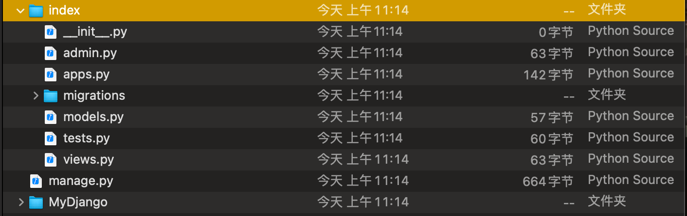
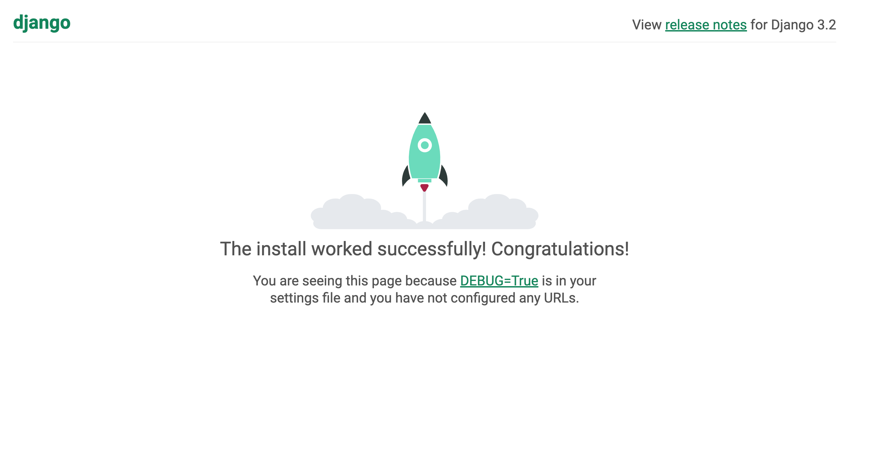
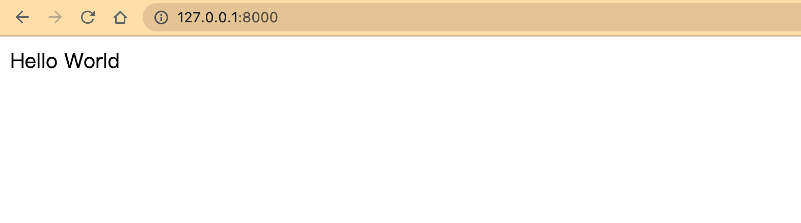

## **第1章 Django 建站基础**

### **1.1 网站的定义与组成**

1.目前大多数网站由域名、空间服务器、DNS域名解析、网站程序和数据组成

2.常见的域名(Domain Name):

- .com:商业性质的机构或公司
- .NET:从事Internet相关的网络服务的机构或公司
- .ORG:非营利的组织、团体
- .GOV:政府部门
- .CN:中国国内域名
- .COM.CN:中国从事Internet相关的网络服务的机构或公司
- .ORG.CN:中国非营利的组织、团体
- .GOV.CN:中国政府部门

3.空间服务器主要有虚拟机、独立服务器和VPS


### **1.2网站的分类**

1.资讯门户类网站（以提供信息资讯为主要目的）：

- 承载的信息类型，例如是否承载多媒体信息、是否承载结构化信息等
- 信息发布的方式和流程
- 信息量的数量级
- 网站用户管理

2.企业品牌网站的分类：

- 企业形象网站：塑造企业形象、传播企业文化、推介企业业务、报道企业活动和展示企业实力
- 品牌形象网站：当企业拥有众多品牌且不同品牌之间的市场定位和营销策略各不相同时，企业可根据不同品牌建立其品牌网站，以针对不同的消费群体
- 产品形象网站：针对某一产品的网站，重点在于产品的体验

3.交易类网站的分类：

- B2C(Business To Consumer)网站:商家—消费者，主要是购物网站，用于商家和消费者之间的买卖，如传统的百货商店和购物广场等
- B2B(Business To Business)网站:商家—商家，主要是商务网站，用于商家之间的买卖，如传统的原材料市场和大型批发市场等
- C2C(Consumer To Consumer)网站:消费者—消费者，主要以拍卖网站为主，用于个人物品的买卖，如传统的旧货市场


### **1.3网站运行原理**

1.常用术语

- 客户端：在计算机上运行并连接到互联网的应用程序，简称浏览器，如Chrome、Firefox。用户通过操作客户端实现网站和用户之间的数据交互
- 服务器：能连接到互联网且具有IP地址的计算机。服务器主要接收和处理用户的请求信息。
- IP地址：互联网地址协议，TCP/IP网络设备的数字标识符。
- 域名：用于标识一个或多个IP地址
- DNS：域名系统，用于跟踪计算机的域名及其在互联网上相应的IP地址
- TCP/IP：传输控制协议/互联网协议，是广泛使用的通信协议
- HTTP：超文本传输协议，是浏览器和服务器通过互联网进行通信的协议

2.网站的运行原理

(1)在浏览器中输入网址

(2)浏览器解析网址中包含的信息，如HTTP协议和域名

​(3)浏览器与ISP通信，在DNS中查找网站对应的IP地址，然后将IP地址发送给浏览器的DNS服务，最后向网站的IP发送访问请求

(4)浏览器从网站地址中获取IP地址和端口，并打开TCP套接字连接，实现浏览器和Web服务器的连接

(5)浏览器根据用户操作向服务器发送相应的HTTP请求

(6)当Web服务器接收请求后，根据请求信息查找该HTML页面。

3.网站的开发流程

​(1)需求分析：当拿到一个项目时，必须进行需求分析，清楚知道网站的类型、具体功能、业务逻辑以及网站的风格，此外还要确定域名、网站空间或服务器以及网站备案等

​(2)规划静态内容：重新确定需求分析，并根据用户需求规划网站的内容板块草图

(3)设计阶段：根据网站草图由美工制成效果图。

(4)程序开发阶段：根据草图划分页面结构和设计，前端和后台可以同时进行。前端根据美工效果制作静态页面；后台根据页面结构和设计，设计数据库数据结构和开发网站后台

(5)测试和上线：在本地搭建服务器，测试网站是否存在Bug

(6)维护推广：在网站上线之后，根据实际情况完善网站的不足，定期修复和升级，保障网站运营顺畅，然后对网站进行推广宣传等

### **1.4走进Django**

1.Django采用MTV的框架模式，即模型（Model）、模版（Template）和视图（Views）：

- 模型：数据存取层，处理与数据相关的所有事物
- 模板：表现层、处理与表现相关的决定
- 视图：业务逻辑层，存取模型及调取恰当模板的相关逻辑，模型与模版的桥梁

2.Django的特点：

- 对象关系映射(Object Relational Mapping, ORM)：通过定义映射类来构建数据模型，将模型与关系型数据库连接起来，使用ORM框架内置的数据库接口可实现复杂的数据操作
- URL设计：开发者可以设计任意的URL（网站地址），而且还支持使用正则表达式设计
- 模板系统：提供可扩展的模板语言，模板之间具有可继承性
- 表单处理：可以生成各种表单模型，而且表单具有有效性检验功能
- Cache系统：完善的缓存系统，可支持多种缓存方式
- Auth认证系统：提供用户认证、权限设置和用户组功能，功能扩展性强
- 国际化：内置国际化系统，方便开发出多种语言的网站
- Admin后台系统：内置Admin后台管理系统，系统扩展性强


### **1.6安装Django**

拥有python环境在终端中输入

```shell
pip insatll Django
```

### **1.7创建项目**

```shell
django-admin startproject MyDjango
```

在MyDjango项目中包含MyDjango文件夹和manage.py文件，而My Django文件夹又包含4个.py文件。

- manage.py：命令行工具，内置多种方法与项目进行交互。在命令提示窗口下，将路径切换到MyDjango项目并输入python manage.py help，可以查看该工具的指令信息
- __ init __.py：初始化文件，一般无需修改
- settings.py：项目的配置文件，项目的所有功能都需要在该文件中进行配置
- urls.py：项目的路由设置，设置网站的具体网址内容
- wsgi.py：全称为Python Web Server Gateway Interface，即Python服务器网关接口，是Python应用与Web服务器之间的接口，用于Django项目在服务器上的部署和上线，一般不需要修改

完成项目的创建后，接着创建项目应用，项目应用简称为App，相当于网站功能，每个App代表网站的一个功能。App的创建由文件manage.py实现

```shell
cd MyDjango
python manage.py startapp index
```

​	进入MyDjango，然后python manage.py startapp XXX创建，其中XXX是应用的名称。



​	从上图可以看到，index目录中有多个.py文件和migrations文件夹：

- migrations：用于生成数据迁移文件，通过数据迁移文件可自动在数据库里生成相应的数据表

- __ init __.py：index文件夹的初始化文件

- admin.py：用于设置当前App的后台管理功能

- apps.py：当前App的配置信息

- models.py：定义数据库的映射类，每个类可以关联一张数据表，实现数据持久化，即MTV里面的模型（Model）

- views.py：视图文件，处理功能的业务逻辑，即MTV里面的视图（Views）

  完成项目和App的创建后，最后在命令提示符输入指令启动项目

```
python manage.py runserver 
```




### **1.9Django入门基础**

​	在终端中输入python manage.py help，可以查看相关的指令信息

| changepassword            | 修改内置用户表的用户密码                                     |
| :------------------------ | ------------------------------------------------------------ |
| createsuperuser           | 为内置用户表创建超级管理员账号                               |
| remove_stale_contenttypes | 删除数据库中已不使用的数据表                                 |
| check                     | 检测整个项目是否存在异常问题                                 |
| compilemessages           | 编译语言文件，用于项目的区域语言设置                         |
| createcachetable          | 创建缓存数据表，为内置的缓存机制提供存储功能                 |
| dbshell                   | 进入Django配置的数据库，可以执行数据库的SQL语句              |
| diffsettings              | 显示当前settings.py的配置信息与默认配置的差异                |
| dumpdata                  | 导出数据表的数据并以JSON格式存储，如python manage.py dumpdata index > data.json，这是index的模型所对应的数据导出，并保存在data.json文件中 |
| flush                     | 清空数据表的数据信息                                         |
| inspectdb                 | 获取项目所有模型的定义过程                                   |
| loaddata                  | 将数据文件导入数据表，如python manage.py loaddata data.json  |
| makemessages              | 创建语言文件，用于项目的区域语言设置                         |
| makemigrations            | 从模型对象创建数据迁移文件并保存在App的migrations文件夹      |
| migrate                   | 根据迁移文件的内容，在数据库里生成相应的数据表               |
| sendtestmail              | 向制定的收件人发送测试的电子邮件                             |
| shell                     | 进入Django的Shell模式，用于调试项目功能                      |
| showmigrations            | 查看当前项目的所有数据迁移文件                               |
| sqlflush                  | 查看清空数据的SQL语句脚本                                    |
| sqlmigrate                | 根据迁移文件内容输出相应的SQL语句                            |
| sqlsequencereset          | 重置数据表递增字段的索引值                                   |
| squashmigrations          | 对迁移文件进行压缩处理                                       |
| startapp                  | 创建项目应用App                                              |
| startproject              | 创建新的Django项目                                           |
| test                      | 运行App里面的测试程序                                        |
| testserver                | 运行App里面的测试层序                                        |
| clearsessions             | 清楚会话Session数据                                          |
| collectstatic             | 收集所有的静态文件                                           |
| findstatic                | 查找静态文件的路径信息                                       |
| runserver                 | 在本地计算机上启动Django项目                                 |

​	打开setting.py，找到配置属性INSTALLED_APPS和TEMPLATES，分别将项目应用index和模板文件夹templates添加到相应的配置属性

```python
INSTALLED_APPS = [
    'django.contrib.admin',
    'django.contrib.auth',
    'django.contrib.contenttypes',
    'django.contrib.sessions',
    'django.contrib.messages',
    'django.contrib.staticfiles',
    #append
    'index'
]

TEMPLATES = [
    {
        'BACKEND': 'django.template.backends.django.DjangoTemplates',
        'DIRS': [os.path.join(BASE_DIR, 'templates')],
        'APP_DIRS': True,
        'OPTIONS': {
            'context_processors': [
                'django.template.context_processors.debug',
                'django.template.context_processors.request',
                'django.contrib.auth.context_processors.auth',
                'django.contrib.messages.context_processors.messages',
            ],
        },
    },
]
```

​	最后在项目的urls.py（MyDjango文件夹的urls.py）、views.py（项目应用index的views.py文件）和index.html（templates文件夹的index.html）文件里编写相应的代码，即可实现简单的Hello World网页

```python
#MyDjango的urls.py
from django.contrib import admin
from django.urls import path
from index import views

urlpatterns = [
    path('admin/', admin.site.urls),
    path('', views.index)
]

#index的views.py
from django.shortcuts import render

def index(request):
    return render(request, 'index.html')

#templates的index.html
<!DOCTYPE html>
<html lang="en">
<head>
    <meta charset="UTF-8">
    <title>Hello World</title>
</head>
<body>
    <span>Hello World</span>
</body>
</html>
```

- 当用户在浏览器访问网址的时候，该网址在项目所设置的路由（urls.py文件）里找到相应的路由信息

- 然后从路由信息里找到对应的视图函数（views.py文件），由视图函数处理用户请求

- 视图函数将处理结果传递到模板文件（index.html文件），由模板文件生成网页内容，并在浏览器里展现

  启动MyDjango项目，并在浏览器上访问路由地址即可看到Hello World网页

  

  


## 