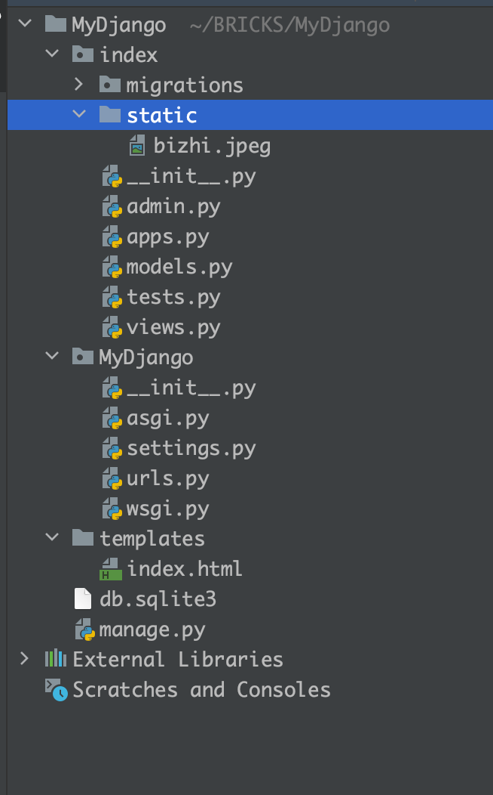
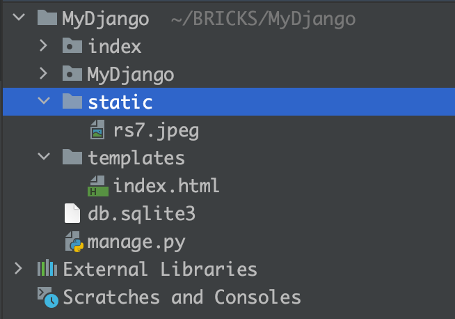
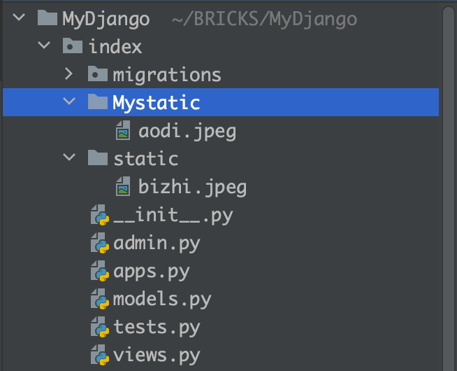
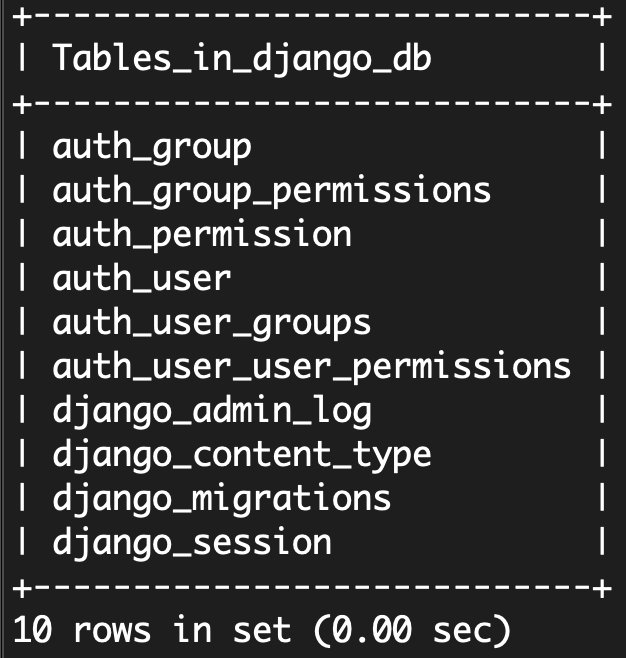
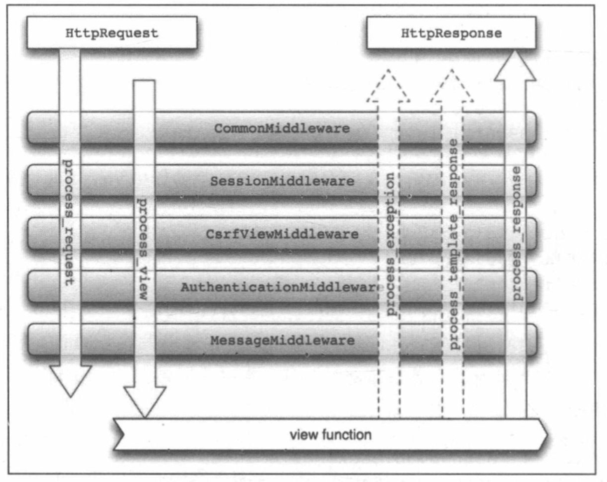

## **第2章Django配置信息**

### **2.1基本配置信息**

​	一个简单的项目必须具备的基本配置信息有：项目路径、密钥配置、域名访问权限、App列表和中间件

​	以MyDjango项目为例，settings.py的基本配置信息如下：

```python
import os
from pathlib import Path
#项目路径
BASE_DIR = Path(__file__).resolve().parent.parent
#密钥配置
SECRET_KEY = 'django-insecure-fpy7oby07m68ne6!y$nyptxwx@(hurcz09(r5n!2mfp_kb54q6'
#调试模式
DEBUG = True
#域名访问权限
ALLOWED_HOSTS = []
#App列表
INSTALLED_APPS = [
    'django.contrib.admin',
    'django.contrib.auth',
    'django.contrib.contenttypes',
    'django.contrib.sessions',
    'django.contrib.messages',
    'django.contrib.staticfiles',
    'index'
]
```

- 项目路径BASE_DIR：主要通过os模块读取当前项目在计算机系统的具体路径，该代码在创建项目时自动生成
- 密钥配置SECRET_KEY：这是一个随机值，在项目创建的时候自动生成，一般情况下无须修改。主要用于重要数据的加密处理，提高项目的安全性，避免遭受恶意攻击。密钥主要用于用户密码、CSRF机制和会话Session等数据加密
  -  用户密码：Django内置一套Auth认证系统，该系统具有用户认证和存储用户信息等功能，在创建用户的时候，将用户密码通过密钥进行加密处理，保证用户的安全性
  -  CSRF机制：该机制主要用于表单提交，防止窃取网站的用户信息来制造恶意请求
  -  会话Session：Session的信息存放在Cookie中，以一串随机的字符串来表示，用于标识当前访问网站的用户身份，记录相关用户信息
- 调试模式DEBUG：该值为布尔类型。如果在开发调试阶段，那么应设置为True，在开发调试过程中会自动检测代码是否大声更改，根据检测结果执行是否刷新系统。如果项目部署上线，那应该将其改为False，否则会泄露项目的相关信息
- 域名访问权限ALLOWED_HOSTS：设置可访问的域名，默认值为空列表。当DEBUG为True并且ALLOWED_HOSTS为空列表时，项目只允许以localhost或127.0.0.1在浏览器上访问。当DEBUG为False时，ALLOWED_HOST为必填项，否则程序无法启动，如果想允许所有域名访问，可设置ALLOW_HOSTS=['*']
- App列表INSTALLED_APPS：告诉Django有哪些App。在项目创建时已有admin、auth和session等配置信息，这些都是Django内置的应用功能
  - admin：内置的后台管理系统
  - auth：内置的用户认证
  - contenttypes：记录项目中所有model元数据（Django的ORM框架）
  - session：Session会话功能，用于标识当前访问网站的用户身份，记录相关用户信息
  - message：消息提示功能
  - staticfiles：查找静态资源路径

### **2.2资源配置**

​	资源文件配置分为静态资源和媒体资源。静态资源的配置方式由配置属性STATIC_URL、STATICFILES_DIRS和STATIC_ROOT进行设置；媒体资源的配置方式由配置属性MEDIA_URL和MEDIA_ROOT决定的

**1.资源路由—STATIC_URL**

​	静态资源指的是网站中不会改变的文件。在一般的应用程序中，静态资源包括CSS文件、JavaScript文件以及图片等资源文件。

​	CSS也称层叠样式表（Cascading Style Sheets），是一种用来表现HTML（标准通用标记语言的一个应用）或XML（标准通用标记语言的一个子集）等文件样式的计算机语言。CSS不仅可以静态地修饰网页，还可以配个各种脚本语言对网页元素进行格式化

​	JavaScript是一种直译式脚本语言，也是一种动态类型、弱类型、基于原型的语言，内置支持类型。

​	一个项目在开发过程中肯定需要使用CSS和JavaScript文件，这些静态文件的存放主要由配置文件settings.py设置，Django默认配置信息如下：

```python 
#Static files(CSS, JavaScript, Images)
#https://docs.djangoproject.com/en/2.0/howto/static-files/
STATIC_URL = '/static/'
```

​	默认情况下，Django只能识别项目应用App的static文件夹里面的静态资源。当项目启动时，Django会从项目应用App里面查找相关的资源文件，查找功能主要由App列表INSTALLED_APPS的staticfiles实现。在index中创建static文件夹并在文件夹中放置图片bihzi.jpeg

​	Django在调试模式（DEBUG=True）下只能识别项目应用的App的static文件夹里面的静态资源，如果该文件夹改为其他名字，Django就无法识别，若将static文件夹放在MyDjango的目录下，那也是无法识别的。

​	进一步验证Django在调试模式下只能识别App的static文件夹，我们在index文件夹里创建Mystatic并放置图片，在MyDjango的根目录下创建static文件夹并放置图片

   




​	启动MyDjango并在浏览器中分别访问http://127.0.0.1:8000/static/bizhi.jpeg、http://127.0.0.1:8000/static/rs7.jpeg、http://127.0.0.1:8000/static/aodi.jpeg，可以发现只有第一个可以访问

​	从上述例子说明，若资源路由STATIC_URL的值为/static/，则浏览器访问静态资源的网站必须为static，否则无法访问，并且Django在调试模式下只能识别App目录下的static文件夹

**2.资源集合—STATICFILES_DIRS**

​	在配置文件settings.py中设置STATICFILES_DIRS属性。该属性以列表的形式表示，设置方式如下：

```python 
#设置根目录的静态资源文件夹static
STATICFILES_DIRS = [os.path.join(BASE_DIR, 'static'),
#设置App(index)的静态资源文件夹Mystatic                  	
os.path.join(BASE_DIR, 'index/Mystatic'),]
```

​	再次启动MyDjango并在浏览器上 访问图片，可以发现三者都可以正常访问。	

​	浏览器访问图片的时候，图片路径皆为http://127.0.0.1:8000/static/xxx.jpeg，图片路径的static是指资源路径STATIC_URL的值，若将STATIC_URL的值改为Allstatic，则再次重启MyDjango项目并在浏览器上将图片资源路径的static改为Allstatic即可

**3.资源部署—STATIC_ROOT**

​	静态资源配置还有STATIC_ROOT，其作用是在服务器上部署项目，实现服务器和项目之间的映射。STATIC_ROOT主要收集整个项目的静态资源并存放在一个新文件夹，然后由该文件夹与服务器之间构建映射关系。STATIC_ROOT配置如下:

```python 
STATIC_ROOT = os.path.join(BASE_DIR,  'AllStatic')
```

​	当项目的配置属性DEBUG设为True的时候，Django会自动提供静态文件代理服务，此时整个项目处于开发阶段，因此无需使用STATIC_ROOT。当配置属性DEBUG设为False的时候，意味着项目进入生产环境，Django不再提供静态文件代理服务，此时需要在项目的配置文件中设置STATIC_ROOT

​	设置STATIC_ROOT需要使用Django操作指令collectstatic来收集所有静态资源，这些静态资源都会保存在STATIC_ROOT所设置的文件夹里。

**4.媒体资源—MEDIA**

​	媒体资源和静态资源是可以同时存在的，而且两者都可以独立运行，互不影响，而媒体资源只有配置属性MEDIA_URL和MEDIA_ROOT。以MyDjango为例，在MyDjango的根目录下创建media文件夹并存放图片

然后在配置文件settings.py里设置配置属性MEDIA_URL和MEDIA_ROOT，MEDIA_URL用于设置媒体资源的路由地址，MEDIA_ROOT用于获取media文件夹在计算机系统的完整路径信息


```python
#设置媒体路由地址信息
MEDIA_URL = '/media/'
#获取media文件夹的完整路径信息
MEDIA_ROOT = os.path.join(BASE_DIR, 'media')
```

​	配置属性设置后，还需要将media文件夹注册到Django里，让Django知道如何找到媒体文件，否则无法在浏览器上访问该文件夹的文件信息。打开MyDjango文件夹的urls.py文件，为媒体文件夹media添加相应的路由地址

```python
from django.contrib import admin
from django.urls import path, re_path
#导入项目应用index
from index import views
#配置媒体文件夹media
from django.views.static import serve
from django.conf import settings

urlpatterns = [
    path('admin/', admin.site.urls),
    path('', views.index),
    #配置media的路由地址
    re_path('media/(?<Path>.*)', serve, {'document_root':settings.MEDIA_ROOT}, name='media')
]

```

​	再次启动MyDjango，并在浏览器上访问http://127.0.0.1:8000/media/pic.jpeg和http://127.0.0.1:8000/static/rs7.jpeg，皆可正常访问

### **2.3模版配置**

​	在Web开发中，模版是一种比较特殊的HTML文档。这个文档HTML文档嵌入了一些能够让Django识别的变量和指令，然后由Django的模板引擎解析这些变量和指令，生成完整的HTML网页返回给用户浏览。创建项目时，Django已有初始的模板配置信息，如下所示：

```python
TEMPLATES = [
    {
        'BACKEND': 'django.template.backends.django.DjangoTemplates',
        'DIRS': [os.path.join(BASE_DIR, 'templates')],
        'APP_DIRS': True,
        'OPTIONS': {
            'context_processors': [
                'django.template.context_processors.debug',
                'django.template.context_processors.request',
                'django.contrib.auth.context_processors.auth',
                'django.contrib.messages.context_processors.messages',
            ],
        },
    },
]

```

​	模版配置是以列表格式呈现的，每个元素具有不同的含义：

- BACKEND：定义模板引擎，用于识别模板里面的变量和指令，内置的模板引擎有Django Templates和jinja2.Jinja2，每个模板引擎都有自己的变量和指令语法

- DIR：设置模板所在路径，告诉Django在哪个地方查找模板的位置，默认为空列表

- APP_DIRS：是否在 App里查找模板文件

- OPPTIONS：用于填充在RequestContext的上下文（模板里面的变量和指令），一般情况下不做任何修改

  模板配置通常配置DIRS的属性值即可，在项目的根目录和index下分别创建templates文件夹，并在文件夹下分别创建文件index.html和app_index.html

  一般情况下，根目录的templates通常存放共用的模板文件，能为各个App的模板文件调用，这个模式符合代码重复使用原则。配置属性TEMPLATES的配置信息

  ```python
  TEMPLATES = [
      {
        'BACKEND':'django.template.backends.django.DjangoTemplates',
          'DIRS': [os.path.join(BASE_DIR, 'templates'),
                  os.path.join(BASE_DIR, 'index/templates')],
          'APP_DIRS': True,
          'OPTIONS': {
              'context_processors': [
                  'django.template.context_processors.debug',
                  'django.template.context_processors.request',
                  'django.contrib.auth.context_processors.auth',
                  'django.contrib.messages.context_processors.messages',
              ],
          },
      },
  ]
  
  ```

### **2.4数据库配置**

**1.mysqlclient连接MySQL**

​	数据库配置是选择项目所使用的数据库类型， 不同的数据库需要设置不同的数据库引擎，数据库引擎用于实现项目与数据库的连接，Django提供4种数据库引擎：

- 'django.db.backends.postgresql'
- 'django.db.backends.mysql'
- 'django.db.backends.sqlite3'
- 'django.db.backends.oracle'


​	项目创建时默认使用Sqlite3数据库，这是一款轻型的数据库，常用于嵌入式系统开发，而且占用的资源非常少。Sqlite3数据库配置信息如下：

```python 
DATABASES = {
    'default': {
        'ENGINE': 'django.db.backends.sqlite3',
        'NAME': BASE_DIR / 'db.sqlite3',
    }
}
```

​	如果把上述连接信息改为MySQL数据库，首先安装mysqlclient模块。

```shell
pip insatll mysqlclient
```

​	完成mysqlclient模块的安装后，在项目的配置文件settings.py中配置MySQL数据库连接信息

```python
DATABASES = {
    'default': {
        'ENGINE': 'django.db.backends.mysql',
        'NAME': 'django_db',
        'USER': 'root',
        'PASSWORD': '12345678',
        'HOST': '127.0.0.1',
        'POST': '3306',
    }
}
```

​	在MySQL中创建数据库django_db，刚创建的数据库django_db是一个空白的数据库，接着在PyCharm的Termin界面下输入Django操作指令python manage.py migrate来创建Django内置功能的数据表。因为Django自带内置功能，如Admin后台系统、Auth用户系统和会话机制等功能，该指令可以将内置的迁移文件生成数据表。然后在数据库中查看是否生成相应的数据表



**2.pymsql连接MySQL**

除了使用mysqlclient模块连接之外，还可以使用pymysql模块连接数据库。pymsql模块也可用pip。pymsql模块安装完成之后，项目配置文件settings.pyd数据库配置信息无须修改，只要在MyDjango文件夹的__ init __.py中设置数据库连接模块即可

```python
#MyDjango文件夹的__init__.py
import pymsql
pymsql.install_as_MySQLdb()
```

**3.多个数据库的连接方式**

一个项目里可能需要多个数据库才能满足开发需求，特别对于数据量过大的系统，单个数据库存储的数据越多就会使服务器负载越大，因此会将数据划分为多个数据库服务器共同存储，若Django想利用这些数据开发功能系统，则需要对各个数据库服务器进行连接

​	从Django单个数据库连接信息看到，配置属性DATABASES的属性值是以字典的格式表示的，字典里的每一对键值代表某一个数据库。因此，我们在配置属性DATABASES里设置多对键值对即可实现多个数据库连接。

```python 
DATABASES = {
#first database
'default': {
		'ENGINE': 'django.db.backends.mysql',
		'NAME':'django_db',
		'USER': 'root',
		'PASSWORD': '****',
		'HOST': '127.0.0.1',
		'PORT': 3306,
	},
#second database
'default': {
		'ENGINE': 'django.db.backends.mysql',
		'NAME':'django_db',
		'USER': 'root',
		'PASSWORD': '****',
		'HOST': '127.0.0.1',
		'PORT': 3306,
	},
#third database
'default': {
		'ENGINE': 'django.db.backends.sqlite3',
		'NAME': os.path.join(BASE_DIR, 'sqlite3'),
	},	
}
```

​	若项目中连接了多个数据库，则数据库之间的使用需要遵循一定的规则和设置。比如项目中定义了多个模型，每个模型所对应的数据表可以选择在某个数据库中生成，如果模型没有指向某个数据库，模型就会在key为default的数据库里生成

**2.5中间件**

​	中间件(Middleware)是一个用来处理Django的请求（Request）和响应（Response）的框架级别的钩子，它是一个轻量、低级别的插件系统，用于在全局范围内改变Django的输入和输出

​	当用户在网站中进行某个操作时，这个过程是用户向网站发送HTTP请求（Request）：而网站会根据用户的操作返回相关的网页内容，这个过程称为相应处理（Response）。从请求到响应的过程中，当Django接收到用户请求时，首先经过中间件处理请求信息，执行相关的处理，然后将处理结果返回给用户。



​	从图中可以看出，中间的作用是处理用户请求信息和返回响应内容。开发者可以根据自己的开发需求自定义中间件，只要将自定义的中间件添加到配置属性MIDDLEWARE中即可激活

​	一般情况下，Django默认的中间件配置均可满足大部分的开发需求。我们在项目的MIDDLEWARE中添加LocaleMiddleware中间件，使得Django内置的功能支持中文显示：

```python
MIDDLEWARE = [
    'django.middleware.security.SecurityMiddleware',
    'django.contrib.sessions.middleware.SessionMiddleware',
    'django.middleware.common.CommonMiddleware',
    'django.middleware.csrf.CsrfViewMiddleware',
    'django.contrib.auth.middleware.AuthenticationMiddleware',
    'django.contrib.messages.middleware.MessageMiddleware',
    'django.middleware.clickjacking.XFrameOptionsMiddleware',
]
```

​		配置属性MIDDLEWARE的数据格式列表类型，每个中间件的设置顺序是固定的，如果随意变更中间件，就很容易导致程序异常

- SecurityMiddleware：内置的安全机制，保护用户与网站的通信安全
- SessionMiddleware：会话Session功能
- LocaleMiddleware：国际化和本地化功能
- CommonMiddleware：处理请求信息，规划化请求内容
- CsrfViewMiddleware：开启CSRF防护功能
- AuthenticationMiddleware：开启内置的用户认证系统
- Message Middleware：开启内置的信息提示功能
- XFrameOptionsMiddleware：防止恶意程序单击劫持

