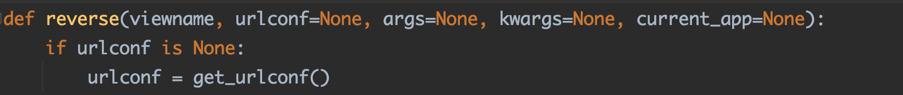

# 第3章初探路由

​	一个完整的路由包含：路由地址、视图函数（或视图类）、可选变量和路由命名

**3.1路由定义规则**

​	路由称为URL（Uniform Resource Locator，统一资源定位符），也可以称为URLconf，是对可以从互联网上得到的资源位置和访问方法的一种简洁的表示，是互联网上标准资源的地址。互联网上的每个文件都有一个唯一的路由，用于指出网站文件的路径位置。

**1.Django 2.x路由定义**

​	我们知道完整的路由包含：路由地址、视图函数（或者视图类）、可选变量和路由命名。其中基本的信息必须有：路由地址和视图函数

​	对MyDjango的目录进行调整，使其更符合开发规范性。在index文件夹里添加一个空白内容的urls.py。在App（index文件夹）里添加urls.py是将所有属于App的路由都写入该文件中，这样更容易管理和区分每个App的路由地址，而MyDjango文件夹的urls.py是将每个App的urls.py统一管理。这种路由设计是Django常用的，其工作原理如下：

​	(1)运行MyDjango项目时，Django从MyDjango文件夹的urls.py找到各个App所定义的路由信息，生成完整的路由列表

​	(2)当用户在浏览器上访问某个路由地址时，Django就会收到该用户的请求信息

​	(3)Django从当前请求信息获取路由地址，并在路由列表里匹配响应的路由信息，再执行路由信息所指向的视图函数，从而完成整个请求响应过程

​	MyDjango文件夹的urls.py代码：

```python
from django.contrib import admin
from django.urls import path, include
urlpatterns = [
    #指向内置Admin后台系统的路由文件sites.py
    path('admin/', admin.site.urls)
    #指向index的路由文件urls.py
    path('', include('index.urls')),
]
```

​	MyDjango文件夹的urls.py定义两条路由信息，分别是Admin站点管理和首页地址（index）。其中，Admin站点管理在创建项目时已自动生成，一般情况下无须更改：首页地址是指index文件夹urls.py。

​	由于首页地址分发给index的urls.py处理，因此下一步需要对index的urls.py编写路由信息，代码如下

```python 
#index.urls
from django.urls import path
from . import views 
urlpatterns = [
    path('', views.index)
]
```

​	index的urls.py的编写规则与MyDjango文件夹的urls.py大致相同，这是最为简单的定义方法，此外还可以参考内置的Admin功能的路由定义方法

​	在index的urls.py导入index的views.py文件，该文件用于编写视图函数或视图类，主要用于处理当前请求信息并返回响应内容给用户。路由信息path("", views.index)的view.index是指视图函数index处理网站首页的用户请求和响应过程。因此，在index的views.py中编写index函数的过程处理，代码如下：

```python
from django.shortcuts import render

def index(request):
    value = 'This is a test!'
    print(value)
    return render(request, 'index.html')
```

​	index函数必须设置一个参数，参数名不固定，但常以request进行命名，代表当前用户的请求对象，该对象包含当前请求的用户名、请求内容和请求方式等

​	视图函数执行完成后必须使用return将处理结果返回，否则程序会抛出异常信息。启动MyDjango项目，在浏览器里访问127.0.0.1:8000

​	从上述例子看到，当启动MyDjango项目时，Django会从配置文件settings.py读取属性ROOT_URLCONF的值，默认值为MyDjango.urls，其代表MyDjango文件夹的urls.py，然后根据ROOT_URLCONF的值来生成整个项目的路由列表

​	路由文件urls.py的路由定义规则是相对固定的，路由列表由urlpatterns表示，每个列表代表一条路由。路由是由Django的path函数定义的，该函数第一个参数是路由地址，第二个参数是由所对应的处理函数（视图函数或视图类），这两个参数是路由定义的必选参数

**2.Django 1.X路由定义**

​	Django1版本的路由定义规则是由Django的url函数定义的，url函数的第一个参数是路由地址，第二个参数是路由所对应的处理函数，这两个参数也是必选参数。而路由地址需设置路由符号^和$。^代表当前路由地址的相对路径；$代表当前路由地址的终止符

​	我们分别改写项目的MyDjango文件夹和index文件夹的urls.py文件，使用Django1.X的路由定义规则；

```python
#MyDjango/urls.py
from django.contrib import admin
from django.conf.urls import url
from django.urls import include
urlpatterns = [
    #指向内置Admin后台系统的路由文件sites.py
    url('admin/', admin.site.urls),
    #指向index的路由文件urls.py
    url('^', include('index.urls'))
]
#index/urls.py
from django.conf.urls import url
from . import views
urlpatterns = [
    url('^$', views.index),
    url('^new/$', views.new)
]
```

​	index文件夹的urls.py定义两条路由信息，因此需要在index文件夹的views.py里定义相应的视图函数，代码如下：

```python
from django.shortcuts import render
from django.http import HttpResponse

def index(request):
    return render(request, 'index.html')

def new(request):
    return HttpResponse('This is a new page')
```

​	在MyDjango文件夹的urls.py文件里，url('^', include('index.urls'))的路由符号^代表当前路由地址的相对地址，即http://127.0.0.1:8000。该路由使用了Django的路由函数include，它将路由交给index文件夹的urls.py完成路由定义

​	路由符号$代表路由地址的终止位置，如果没有终止符号$，那么在浏览器输入任意地址都能成功访问该路由地址。以url('^new/$', views.new)为例，若将终止符号$去掉，则在浏览器访问http://127.0.0.1:8000/new/XXX时，其XXX内容不限，这样的路由地址都符合 url('^new/', views.new)定义规则，从而执行视图函数new完成相应过程

**3.路由变量的设置**

​	在日常开发过程中，有时一个路由可以代表多个不同的页面，如编写带有日期的路由，若根据前面的编写方式，一年就需要编写365个不同的路由才能实现，这种做法并不可取。因此Django在定义路由时，可以对路由设置变量值，使路由具有多样性。

​	路由的变量类型有字符类型、整型、slug和uuid，最为常用的是字符类型和整型。

- 字符类型：匹配任何非空字符串，但不含斜杠。如果没有指定类型，就默认使用该类型
- 整型：匹配0和正整数
- slug：可理解为注释、后缀或附属等概念，常作为路由的解释性字符。可匹配任何ASCII字符以及连接符和下划线，能使路由更加清晰易懂。比如网页的标题是“13的孩子”，其路由地址可以设置为“13-sui-hai-zi”
- uuid：匹配一个uuid格式的对象。为了防止冲突，规定必须使用“-”并且所有的字母必须小写，例如057194d3-6885-417e-a8a8-6c931e272f00

​	根据上述变量类型，在MyDjango项目的index文件夹的urls.py里新定义路由，并且带有字符类型、整型和slug的变量，代码如下：

```python
#index/urls.py
from django.urls import path
from . import views
urlpatterns = [
    #addstr
    path('<year>/<int:month>/<slug:day>', views.myvariable)
]
```

​	在路由中，使用变量符号“<>”可以为路由设置变量。在括号里面以冒号划分两部分，冒号前面代表的是变量的数据类型，冒号后面代表的是变量名，变量名可以自行命名，如果没有设置变量的数据类型，就默认为字符类型。

​	在上述新增的路由中，路由的处理函数为myvariable，因此index的views.py中编写视图函数myvariable的处理过程，代码如下：

```python
#views.py func-myvariable
from django.http import HttpResponse
def myvariable(request, year, month, day):
	return HttpResponse(str(year) + '/' + str(month) + '/' + str(day))
```

​	视图函数中myvariable有4个参数，其中参数year、month和day的参数值分别来自路由地址所设置的变量< year >、<int: month>和< slug:day> 。启动项目，在浏览器上输入127.0.0.1:8000/2021/9/24


​	除了在路由地址设置变量外，Django还支持在路由地址外设置变量（路由的可选变量）。我们在index的urls.py和views.py中分别新增路由和视图函数，代码如下：

```python
#index/urls.py
from django.urls import path
from . import views
urlpatterns = [
    path('<year>/<int:month>/<slug:day>', views.myvariable),
    path('', views.index, {'month': '2021/09/25'})
]
#index/views.py
from django.http import HttpResponse
def myvariable(request, year, month, day):
    return HttpResponse(str(year) + '/' + str(month) + '/' + str(day))

def index(request, month):
    return HttpResponse('这是路由地址之外的变量:'+ month)
```

​	重新运行MyDjango，访问127.0.0.1:8000运行结果如下


**4.正则表达式的路由定义**

​	为了进一步规范日期格式，可以使用正则表达式限制路由地址变量的取值范围。在index文件夹的urls.py里使用正则表达式定义路由地址，代码如下：

```python
#index/urls.py
from django.urls import re_path
from . import views
urlpatterns = [
    re_path('(?P<year>[0-9]{4})/(?P<month>[09]{2})/(?P<day>[0-9]{2}).html', views.mydate)
]
```

​	路由的正则表达式是由函数re_path定义的，其作用是对路由变量进行截取与判断，正则表达式是以小括号为单位的，每个小括号的前后可以使斜杠或者其他字符将其分割与结束。以(?P<year>[0-9]{4})为例，?P是固定格式，字母P必须为大写；<year>为变量名；[0-9]{4}是正则表达式的匹配模式，代表变量的长度为4，只允许取0～9的值

​	上述路由的处理函数为mydate函数，因此还需要在index的views.py中编写视图函数mydate，代码如下:

```python
#views.mydate
from django.http import HttpResponse
def mydate(request, year, month, day):
	return HttpResponse(str(year) + '/' + str(month) + '/' str(day))
```

​	启动MyDjango项目，在浏览器上输入127.0.0.1:8000/2021/09/25.html即可查看运行结果


​	路由地址的末端设置了".html"，这是一种伪静态URL技术，可将网站设置为静态网址，用于SEO搜索引擎的爬取，如百度、Goole。此外，在末端设置".html"是为变量day设置终止符，假如末端没有设置".html"，在浏览器上输入无限长的字符串也能正常访问


## **3.2命名空间与路由命名**

**1.命名空间namespace**

​	在MyDjango项目创建新的项目应用user，并且在user文件夹里创建urls.py文件，然后在配置文件settings.py的INSTALLED_APPS中添加项目应用user，使得Django在运行的时候能够识别项目应用user

​	在MyDjango文件夹的urls.py中重新定义路由信息，分别指向index文件夹的urls.py和user文件夹的urls.py，代码如下：

```python
from django.contrib import admin
from django.urls import path, include
urlpatterns = [
	path('admin/', admin.site.urls),
	path('', include(('index.urls', 'index'), namespace='index')),
	path('user/', include(('user.urls', 'user'), namespace='user'))
]
```

​	路由函数include设有参数arg和namespace，参数arg指向项目应用App的urls.py文件，其数据格式以元组或字符串表示；可选参数namespace是路由的命名空间。

​	若要对路由设置参数namespace，则参数arg必须以元组格式表示，并且元组的长度必须为2。元组的元素说明：

- 第一个元素为项目应用的urls.py文件
- 第二个元素可以自行命名，但不能为空，一般情况是以项目应用的名称进行命名。

**2.路由命名name**

​	在上一节的基础上，我们在index文件夹的urls.py和user文件夹的urls.py中重新定义路由，代码如下:

```python 
#index/urls.py
from django.urls import path, re_path
from . import views
urlpatterns = [
    re_path('(?P<year>[0-9]{4}).html', views.mydate, name='mydate'),
    path('',  views.index, name='index')
]
#user/urls.py
from django.urls import path
from . import views

urlpatterns = [
    path('index', views.index, name='index'),
    path('login', views.userLogin, name='userLogin')
]
```

​	每个项目应用的urls.py都定义了两条路由，每条路由都由相应的视图函数进行处理，因此在index/views.py和user/views.py中定义视图函数，代码如下：

```python
#index/views.py
from django.shortcuts import render
from django.http import HttpResponse
def mydate(request, year, month, day):
    return HttpResponse(str(year))
def index(request, month):
    return render(request, 'index.html')
#user/views.py
from django.http import HttpResponse
def index(request):
    return HttpResponse('This is a userIndex')
def userLogin(request):
    return HttpResponse('This is a userLogin')
```

​	项目应用index和user的urls.py所定义的路由都设置了参数name，这是对路由进行命名，它是路由函数path或re_path的可选参数。如果路由里使用路由函数include，就可以对该路由设置参数name，因为路由的命名空间namespace是路由函数include的可选参数，而路由命名name是路由函数path或re_path的可选参数，两者隶属于不同的路由函数，因此可以在同一条路由里共存

## **3.3路由的使用方式**

**1.在模版中使用路由**

​	从网站开发的角度分析，网址代表路由，若想将项目定义的路由显示在网页上，则要在模版上使用模版语法来生成路由地址。Django内置了一套模版语法，它能将Python的语法转换成HTML语言，然后通过浏览器解析HTML语言并生成相应的网页内容

​	打开MyDjango项目，该项目仅有一个项目应用文件夹index和模版文件夹templates，在index和templates中分别创建urls.py和index.html并且在settings.py中添加配置信息。


​	项目环境搭建成功后，在MyDjango文件夹的urls.py中使用路由函数path和include定义项目应用文件夹index的路由，代码如下：

```python
#MyDjango/urls.py
from django.contrib import admin
from django.urls import path
from django.urls import include
urlpatterns = [
    path('admin/', admin.site.urls),
    path('', include('index.urls'))
]
```

​	在index里，分别在urls.py和views.py文件中定义路由和视图函数；并且在模板文件夹templates的index.html文件中编写模版内容，代码如下：

```python
#index/urls.py
from django.urls import path, re_path
from . import views
urlpatterns = [
    path('<year>/<int:month>/<slug:day>', views.mydate, name='mydate'),
    path('',  views.index)
]
#index/views.py
from django.shortcuts import render
from django.http import HttpResponse
def mydate(request, year, month, day):
    return HttpResponse(str(year) + '/' + str(month) + '/' + str(day))
def index(request, month):
    return render(request, 'index.html')

#templates/index.html
<!DOCTYPE html>
<html lang="en">
<head>
    <meta charset="UTF-8">
    <title>Hello World</title>
</head>
<body>
    <span>Hello World</span>
    <br>
    <a href="">查看日期</a>
</body>
</html>
```

​	在index.html里，我们使用了Django内置的模版语法url来生成路由地址，模板语法url里设有4个不同的参数，其说明如下：

- mydate：代表命名mediate的路由，即index里的urls.py设有字符类型、整型和slug的路由、
- 2021：代表路由地址year
- 09：代表路由地址变量month
- 25：代表路由地址变量day


​	模板语法url的参数设置与路由定义是相互关联的，具体说明：

- 若路由地址存在变量，则模板语法url需要设置相应的参数值，参数值之间使用空格隔开
- 若路由地址不存在变量，则模板语法url只需设置路由命名name即可，无须设置额外的参数
- 若路由地址的变量与模板url的参数数量不相同，则在浏览器访问网页的时候会提示NoReverseMath at/的错误信息


​	上述例子中，MyDjango文件夹的urls.py在使用函数include定义路由是并没有设置命名空间namespace。若设置了命名空间namespace，则模板里使用路由的方式有所变化。下面对MyDjango文件urls.py和模板文件夹templates的index.html代码进行修改：

```python
#MyDjango/urls.py
from django.contrib import admin
from django.urls import path, re_path, include
#导入项目应用index
from index import views
#配置媒体文件夹media
from django.views.static import serve
from django.conf import settings
urlpatterns = [
    path('admin/', admin.site.urls),
    path('', include('index.urls')),
    path('', include(('index.urls', 'index'), namespace='index')),
]

#templates/index.html
<!DOCTYPE html>
<html lang="en">
<head>
    <meta charset="UTF-8">
    <title>Hello World</title>
</head>
<body>
    <span>Hello World</span>
    <br>
    {# <a href="">查看日期</a> #}
    <a href="">查看日期</a>
</body>
</html>
```

​	从模板文件index.html可以看出，若项目应用的路由设有命名空间namespace，则模板语法url在使用路由时，需要在命名路由name前面添加命名空间namespace并且使用冒号隔开，如“namespace:name”。若路由在定义过程中使用命名空间namespace，而模板语法url没有添加命名空间namespace，则会报错

**2.反向解析reverse和reslove**

​	路由除了在模板里使用之外，还可以在视图里使用。我们知道Django的请求生命周期是指用户在浏览器访问网页时，Django根据网址在路由列表里查找相应的路由，再从路由里找到视图函数或视图类进行处理，将处理结果作为响应内容返回浏览器并生成网页内容。这个生命周期是不可逆的，而在视图里使用这一过程被称为反向解析

​	Django的反向解析主要由函数reverse和resolve实现：函数reverse时通过路由命名或可调用视图对象来生成路由地址；函数resolve是通过路由地址来获取路由对象信息的

​	以MyDjango为例，在MyDjango文件夹的urls.py和index的urls.py里定义路由地址，代码如下：

```python
#MyDjango/urls.py
from django.urls import path, re_path, include
urlpatterns = [
    path('', include(('index.urls', 'index'), namespace='index')),
]
#index/urls.py
from django.urls import path
from . import views
urlpatterns = [
    path('<year>/<int:month>/<slug:day>', views.mydate, name='mydate'),
    path('',  views.index, name='index')
]
```

​	上述代码定义了项目应用index的路由信息，路由命名分别为index和mydate，路由定义过程中设置了命名空间namespace和路由命名name

​	由于反向解析函数reverse和resolve常用于视图（views.py）、模型（models.py）或Admin后台（admin.py）等，因此在视图（views.py）的函数mydate和index里分别使用reverse和resolve，代码如下：

```python
from django.shortcuts import reverse
from django.http import HttpResponse
from django.urls import resolve

def mydate(request, year, month, day):
    args = ['2021', '09', '25']
    result = resolve(reverse('index:mydate', args=args))
    print('kwargs:', result.kwargs)
    print('url_name:', result.url_name)
    print('namespace:', result.namespace)
    print('view_name:', result.view_name)
    print('app_name', result.app_name)
    return HttpResponse(str(year) + '/' + str(month) + '/' + str(day))

def index(request):
    kwargs = {'year': 2021, 'month': 9, 'day': 26}
    args = ['2021', '9', '25']
    print(reverse('index:mydate', args=args))
    print(reverse('index:mydate', kwargs=kwargs))
    return HttpResponse(reverse('index:mydate', args=args))
```

​	函数index主要是使用反向解析函数reverse来生成路由mydate的路由地址。为了进一步了解函数reverse，我们打开其源码

- viewname：代表路由命名或可调用视图对象，一般情况是以路由命名name来生成路由地址的
- urlconf：设置反向解析的URLconf模块。默认情况下，使用配置文件settings.py的ROOT_URLCONF属性（MyDjango文件夹的urls.py）
- args：以列表方式传递路由地址变量，列表元素顺序和数量应与路由地址变量的顺序和数量一致
- kwargs：以字典方式传递路由变量，列表元素顺序和数量应与路由地址变量的顺序和数量一致
- current_app：提示当前正在执行的视图所在的项目，主要起到了提示作用。


​	运行MyDjango项目，在浏览器上访问127.0.0.1:8000，当前请求将视图函数index处理，该函数使用reverse来获取路由命名为mydate的路由地址并显示在网页上


​	接下来分析视图函数mydate，它是在函数reverse的基础上使用函数resolve，源码如下


- path：代表路由地址，通过路由地址来获取对应的路由对象信息
- urlconf：设置反向解析的URLconf模块。默认情况下，使用配置文件settings.py的ROOT_URLCONF属性(MyDjango文件的urls.py)


​	函数resolve是以路由对象作为返回值的，该对象内置多种函数方法来获取具体的路由信息

| 函数方法   | 说明                                       |
| ---------- | ------------------------------------------ |
| func       | 路由的视图函数对象或视图对象               |
| args       | 以列表格式获取路由的变量信息               |
| kwargs     | 以字典格式获取路由的变量信息               |
| url_name   | 获取路由命名name                           |
| app_name   | 获取路由函数include的参数arg的第二个元素值 |
| app_names  | 与app_name功能一致，但以列表格式表示       |
| namespace  | 获取路由的命名空间namespace                |
| namespaces | 与namespace功能一致，但以列表格式表示      |
| view_name  | 获取整个路由的名称，包括命名空间           |

​	运行MyDjango项目，访问127.0.0.1:8000/2021/9/25,在PyCharm的下方查看函数resolve的对象信息


**4.路由重定向**

​	重定向称为HTTP协议重定向，也可以称为网页跳转，它对应的HTTP状态码为301、302、303、307、308。Django的网页重定向有两种方式：第一种方式是路由重定向；第二种方式是自定义视图的重定向。两种重定向方式各有优点，前者是使用Django内置的视图类RedirectView实现的，默认支持HTTP的GET请求；后者是在自定义视图的响应状态设置重定向，能让开发者实现多方面的开发需求。

​	我们在MyDjango项目里分别简述Django的两种重定向方式，在index的urls.py中定义路由trunTo，代码如下：

```python
from django.urls import path, re_path
from . import views
from django.views.generic import RedirectView
urlpatterns = [
    path('<year>/<int:month>/<slug:day>', views.mydate, name='mydate'),
    path('',  views.index, name='index'),
    path('trunTo', RedirectView.as_view(url='/'), name='trunTo')
]
```

​	在路由里使用视图类RedirectView必须使用as_view方法将视图类实例化，参数url用于设置网页跳转的路由地址，'/'代表网站首页（路由命名为index的路由地址）。然后在index的views.py中定义视图函数mydate和index，代码如下:

```python
from django.http import HttpResponse
from django.shortcuts import reverse,redirect

def mydate(request, year, month, day):
    return HttpResponse(str(year) + '/' + str(month) + '/' + str(day))

def index(request):
    print(reverse('index:trunTo'))
    return HttpResponse(reverse('index:mydate', args=[2021, 9, 25]))
```

​	视图函数index是使用重定向函数redirect实现网页重定向的，这是Django内置的重定向函数，其函数参数只需传入路由地址即可实现重定向


