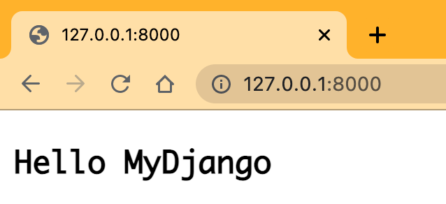
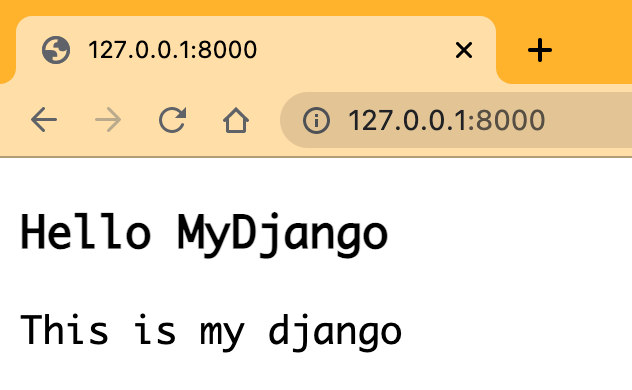
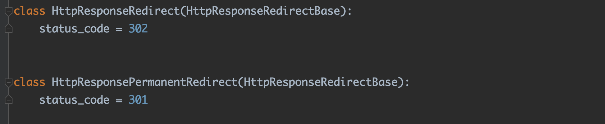
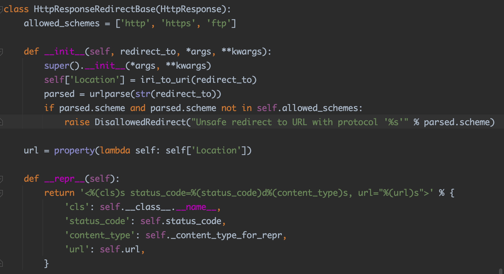
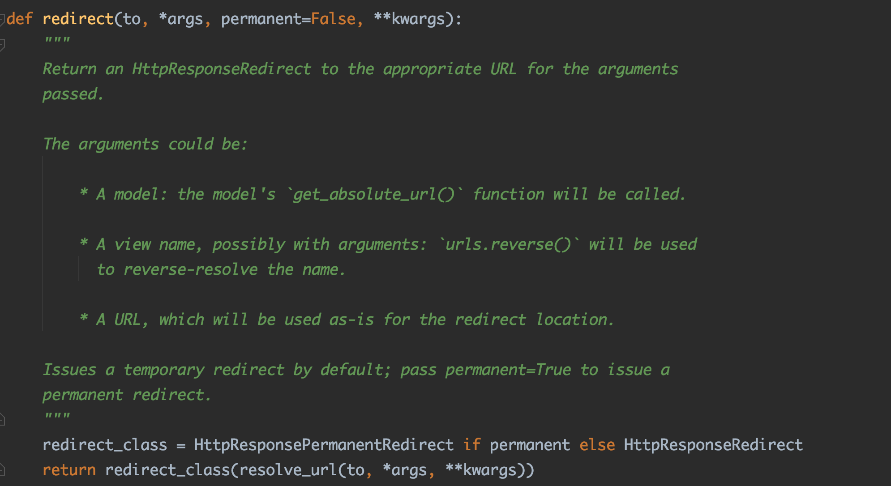
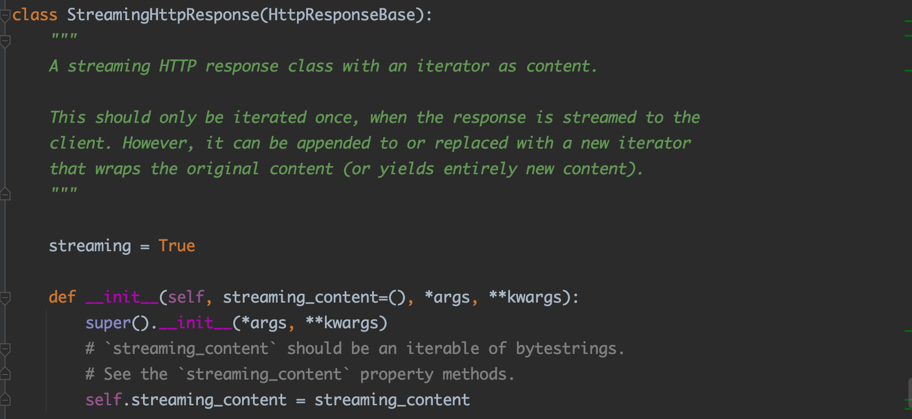
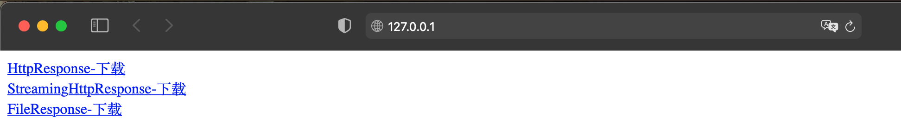
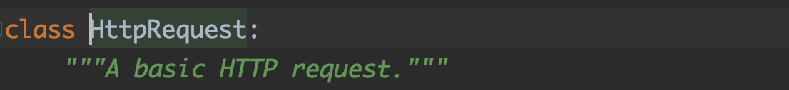
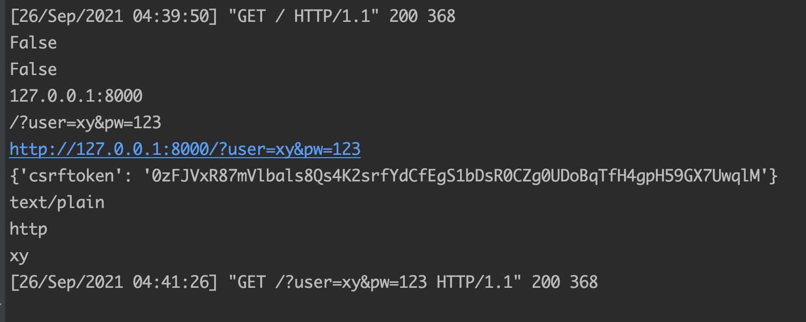

## 第4章 探究FBV视图

​	视图（Views）是Django的MTV架构模式的V部分，主要负责处理用户请求和生成相应的响应内容，然后在页面或其他类型文档中显示。也可以理解为MVC架构里的C部分（控制器），主要处理功能和业务上的逻辑。我们习惯使用视图函数处理HTTP请求，即在视图定义def函数，这种方式称为FBV（Function Base Views）。

### **4.1设置响应方式**

​	网站的运行原理是遵从HTTP协议，分为HTTP请求和HTTP响应。HTTP响应方式也称为HTTP状态码，分为5种状态：消息、成功、重定向、请求错误和服务器错误。若以使用频率划分，则HTTP状态码可分为：成功、重定向和异常响应（请求错误和服务器错误）

**1.返回响应内容**

​	视图函数是通过return方式返回响应内容，然后生成相应的网页内容呈现在浏览器上。return是Python的内置语法，用于设置函数的返回值，若要设置不同的响应方式，则需要使用Django内置的响应类。

| 响应类型                           | 说明                                  |
| ---------------------------------- | ------------------------------------- |
| HttpResponse('Hello world')        | 状态码200，请求已成功被服务器接收     |
| HttpResponseRedirect('/')          | 状态码302，重定向首页地址             |
| HttpResponsePermanentRedirect('/') | 状态码301，永久重定向首页地址         |
| HttpResponseBadRequest('400')      | 状态码400，访问的页面不存在或请求错误 |
| HttpResponseNotFound('404')        | 状态码404，网页不存在或网页URL失效    |
| HttpResponseForbidden('403')       | 状态码403，没有访问权限               |
| HttpResponseNotAllowed('405')      | 状态码405，不允许使用该请求方式       |
| HttpResponseServerError('500')     | 状态码500，服务器内容错误             |
| JsonResponse({'foo': 'bar'})       | 默认状态码200，响应内容为JSON         |
| StreamingHttpResponse()            | 默认状态码200，响应内容以流式输出     |

​	不同的响应方式代表不同的HTTP状态码，其核心作用是Web Server服务器用来告诉浏览器当前的网页请求发生了什么事，或者当前Web服务器的响应状态。上述的响应类主要来自于模块django.http，该模块是实现响应功能的核心。以HttpResponse为例，在MyDjango项目的index文件夹的urls.py和views.py中编写功能代码：

```python
#index/urls.py
from django.urls import path
from . import views
urlpatterns = [
    path('',  views.index, name='index'),
]
#index/views.py
from django.http import HttpResponse
def index(request):
    html = '<h1>Hello World</h1>'
    return HttpResponse(html, status=200)
```

​	视图函数index使用响应类HttpResponse实现响应过程。从HttpResponse的参数可知，第一个参数是响应内容，一般是网页内容或JSON数据，网页内容是以HTML语言为主的，JSON数据用于生成API接口数据。第二个参数用于设置HTTP状态码，它支持HTTP所有的状态码

​	从HttpResponse的使用过程可知，如果生成网页内容，就需要将HTML语言以字符串的形式表示，如果网页内容过大，就会增加视图函数的代码量，同时也没有体现模版的作用。因此，Django在此基础上进行了封装处理，定义了函数render、render_to_response和redirect。

​	render和render_to_response实现是一致的。现在对render进行讲解。


​	render的参数request和template_name是必需参数，其余的参数是可选参数：

- request：浏览器向服务器发送的请求对象，包含用户信息、请求内容和请求方式
- Template_name：设置模版文件名，用于生成网页内容
- content：对模版上下文（模版变量）赋值，以字典格式表示，默认情况是一个空字典
- content_type：响应内容的数据格式，一般情况使用默认值即可
- status：HTTP状态码，默认为200
- using：设置模版引擎，用于解析模版文件，生成网页内容


​	以MyDjango为例，在index/views.py和templates/index.html编写以下代码：

```python
#index/views.py
from django.shortcuts import render
def index(request):
    value = {'title': 'Hello MyDjango'}
    return render(request, 'index.html', context=value)
#templates/index.html
<!DOCTYPE html>
<html>
<body>
<h3>{{ title }}</h3>
</body>
</html>
```

​	视图函数index定义的变量value作为render的参数contenxt，而模版index.html里面通过使用模版上下文（模版变量）{{titile}}来获取变量value的数据，上下文的命名必须与变量value的数据命名（字典的key）相同，这样的Django内置的模版引擎才能将参数context（变量value）的数据与模版上下文进行配对，从而将参数context的数据转换成网页内容。



在实际开发过程中，如果视图传递的变量过多，在设置参数context时就显得非常冗余，而且不利于日后的维护和更新。因此，可以使用Python内置语法locals()取代参数context，在index/views.py和templates/index.html中重新编写代码

```python
#index/views.py
from django.shortcuts import render
def index(request):
    title = {'key': 'Hello MyDjango'}
    content = {'key': 'This is my django'}
    return render(request, 'index.html', locals())
#templates/index.html
<!DOCTYPE html>
<html>
<body>
<h3>{{ title.key }}</h3>
<div>{{ content.key  }}</div>
</body>
</html>
```

​	下图为运行结果



​	HttpResponse、HttpResponseRedirect和HttpResponseNotFound等，其中最为核心的响应类是HttpResponse，它是所有响应类的基础。render，该函数能直接读取模板文件，并且能设置多种响应方式

**2.设置重定向**

​	重定向的状态码为301和302，前者是永久性跳转，后者是临时跳转，两者的区别在于搜索引擎的网页抓取。301重定向是永久的重定向，搜索引擎在抓取新内容的同时会讲旧的网址替换为重定向之后的网址。302跳转是暂时的跳转，搜索引擎会抓去新内容而保留旧的网址。

​	重定向类HttpResponseRedirect和HttpResponsePermanentRedirect分别代表HTTP状态302和301，查看两者源码，发现二者都继承HttpResponseRedirectBase类

​	接下来查看HttpResponseRedirectBase的定义过程，发现该类继承了HttpResponse，并重写了一些方法



HttpResponseRedirect或HttpResponsePermanentRedirect的使用只需传入路由地址即可，两者只支持路由地址而不支持路由命名传入。为例进一步完善功能，Django在此基础上定义了重定向函数redirect，该函数支持路由地址或路由命名的传入，并且能通过函数参数来设置重定向的状态码。



- 判断参数permanent的真假性来选择重定向的函数。若参数permanent为True，则调用HttpResponsePermanentRedirect来完成重定向过程；若为False，则调用HttpResponseRedirect。
- 由于HttpResponseRedirect和HttpResponsePermanentRedirect只支持路由地址的传入，因此函数redirect调用resolve_url方法对参数t0进行判断。若参数t0是路由地址，则直接将参数t0的参数值返回；若参数t0是路由命名，则使用reverse函数转换路由地址；若参数t0是模型对象，则将模型转换成相应的路由地址


​	函数redirect是将HttpResponseRedirect和HttpResponsePermanentRedirect的功能进行完善和组合。我们在MyDjango项目里讲述这三者的使用方法

```python
#index/urls.py
from django.urls import path
from . import views
urlpatterns = [
    path('',  views.index, name='index'),
    path('shop', views.shop, name='shop')
]
#index/views.py
from django.http import HttpResponseRedirect, HttpResponsePermanentRedirect
from django.http import HttpResponseRedirect
from django.shortcuts import render, redirect, reverse

def index(request):
    return redirect('index:shop', permanent=True)
	#设置302的重定向
    #url = reverse('index:shop')
    #return HttpResponseRedirect(url)
    #设置301的重定向
    #return HttpResponsePermanentRedirect(url)
    
def shop(request):
    return render(request, 'index.html')
```

​	视图函数index的响应函数redirect将参数设为True，并跳转到路由命名为shop的网页；若使用HttpResponseRedirect和HttpResponsePermanentRedirect，则需要使用reverse函数将路由命名转换成路由地址。

**3.异常响应**

​	异常响应是指HTTP状态码为404或500的响应状态，它与正常的响应过程是一样的，只是HTTP状态码有所不同，因此使用redirect作为响应过程，并设置参数status的状态码即可实现异常响应

​	在MyDjango/urls.py中定义路由以及在index/views.py中定义视图函数，代码如下：

```python
#MyDjango/urls.py
from django.urls import path, re_path, include
urlpatterns = [
    path('', include(('index.urls', 'index'), namespace='index')),
]
#set 404 page
handler404 = 'index.views.page_not_found'
#set 500 page
handler500 = 'index.views.page_error'

#index/views.py
from django.shortcuts import render

def page_not_found(request, exception):
    return render(request, '404.html', status=404)

def page_error(request, exception):
    return render(request, '500.html', status=500)
```

​	同时在index/templates中创建404.html,500.html，代码如下:

```html
<!-- 404.html -->
<!DOCTYPE html>
<html lang="en">
<body>
<h3>This is a 404 page</h3>
</body>
</html>

<!-- 500.html -->
<!DOCTYPE html>
<html>
<body>
<h3>This is a 500 page</h3>
</body>
</html>
```

​	上述内容是Django全局404和500的异常响应，只需在项目的urls.py中设置handler404和handler500.变量值是指向某个项目应用的视图函数，而被指向的视图函数需要设置相应的模版文件和状态响应码

​	为了验证全局404和500的异常响应，需要对MyDjango项目进行功能调整，修改settings.py的DEBUG和ALLOWED_HOSTS,代码如下：

```python
#settings.py
DEBUG = False

ALLOWED_HOSTS = ['*']

#index/urls.py
from django.urls import path
from . import views

urlpatterns = [
    path('',  views.index, name='index'),
]

#index/views.py
from django.shortcuts import render
from django.http import Http404

def index(request):
    if request.GET.get('error', ''):
        raise Http404("page does not exist")
    else:
        return render(request, 'index.html')
```

**4.文件下载功能**

​	响应内容除了返回网页信息外，还可以实现文件下载功能，是网站最常用的功能之一。Django提供了三种方式实现文件下载，分别是HttpResponse、StreamingHttpResponse和FileResponse：

- HttpResponse是所有响应过程的核心类，它的底层功能类是HttpResponseBase
- StreamingHttpResponse是在HttpResponseBase的基础上进行继承与重写的，它实现流式响应输出（流式响应输出是使用Python的迭代器将数据进行分段处理并传输的），适用于大规模数据响应和文件传输响应
- FileResponse是在StreamingHttpResponse的基础上进行继承与重写的，它实现文件的流失响应输出，只适用于文件传输响应



- 参数streaming_content的数据格式可设为迭代器对象或字节流，代表数据或文件内容
- 形参 *args和 **kwargs设置HttpResponseBase的参数，即响应内容的数据格式content_type和响应状态码status等参数

以MyDjango为例，在MyDjango/urls.py、index/urls.py、index/views.py 和templates/index.html中分别定义路由、视图函数和模版文件，代码如下：

```python
#MyDjango/urls.py
from django.urls import path, re_path, include
urlpatterns = [
    path('', include(('index.urls', 'index'), namespace='index')),
]

#index/urls.py
from django.urls import path
from . import views

urlpatterns = [
    path('',  views.index, name='index'),
    path('downloadfile1', views.downloadfile1),
    path('downloadfile2', views.downloadfile2),
    path('downloaffile3', views.downloaffile3),
]

#index/views.py
from django.shortcuts import render
from django.http import Http404, HttpResponse, StreamingHttpResponse, FileResponse

def index(request):
        return render(request, 'index.html')

def filedownload1(request):
    file_path = '/Users/zhouyuchen/BRICKS/pics/1.png'
    try:
        r = HttpResponse(open(file_path, 'rb'))
        r['content_type'] = 'application/octet-stream'
        r['Content-Disposition'] = 'attachment;filename=1.png'
        return r
    except Exception:
        raise Http404


def filedownload2(request):
    file_path = '/Users/zhouyuchen/BRICKS/pics/2.png'
    try:
        r = HttpResponse(open(file_path, 'rb'))
        r['content_type'] = 'application/octet-stream'
        r['Content-Disposition'] = 'attachment;filename=2.png'
        return r
    except Exception:
        raise Http404


def filedownload3(request):
    file_path = '/Users/zhouyuchen/BRICKS/pics/3.png'
    try:
        r = HttpResponse(open(file_path, 'rb'))
        r['content_type'] = 'application/octet-stream'
        r['Content-Disposition'] = 'attachment;filename=3.png'
        return r
    except Exception:
        raise Http404
        
#templates的index.html
<!DOCTYPE html>
<html>
<body>
    <a href="">HttpResponse-下载</a>
    <br>
    <a href="">StreamingHttpResponse-下载</a>
    <br>
    <a href="">FileResponse-下载</a>
</body>
</html>
```

​	

​	上述例子证明HttpResponse、StreamingHttpResponse和FileResponse都能实现文件下载功能，但三者有一定差异：

- HttpResponse实现文件下载存在很大的弊端，其工作原理是将文件读取并载入内存，然后输出到浏览器实现下载功能。
- StreamingHttpResponse和FileResponse的实现原理是相同的，两者都是将下载的文件分批写入本地磁盘，实现文件的流失响应输出
- 从适用范围来说，StreamingHttpResponse的适用范围更为广泛，可支持大规模数据或文件输出，而FileResponse只支持文件输出
- 从使用方式来说，由于StreamingHttpResponse支持数据或文件输出，因此在使用时 需要设置相应输出类型和方式，而FileResponse 只需设置三个参数即可实现文件下载功能


### **4.2HTTP请求对象**

**1.获取请求信息**

| 请求方式 | 说明                                                   |
| -------- | ------------------------------------------------------ |
| OPTIONS  | 返回服务器针对特定资源所支持的请求方法。               |
| GET      | 向特定资源发出请求（访问网页）                         |
| POST     | 向指定资源提交数据处理请求（提交表单、上传文件）       |
| PUT      | 向指定资源位置上传数据内容                             |
| DELETE   | 请求服务器删除request-URL所标识的资源。                |
| HEAD     | 与GET 请求类似，返回的响应中没有具体内容，用于获取报头 |
| TRACE    | 回复和显示服务器收到的请求，用于测试和诊断             |
| CONNECT  | HTTP/1.1 协议中能够将连接改为管道方式的代理服务器      |

​	对于Django，当它收到HTTP请求之后， 会根据http请求携带的请求参数以及请求信息来创建一个WSGIrequest对象，并且作为视图函数的首个参数。这个参数通常写成request该参数包含用户所有的请求信息。


​	从类SWGIRequest的定义，看到他继承并重写HttpRequest若要获取请求信息，则只需从类SWGIRequest读取相关的类属性即可。

- COOKIE： 获取客户端（浏览器）的cookie信息以字典形式表示，并且键值对都是字符串类型。
- FILES：django.http.request.QueryDict对象，包含所有的文件上传信息
- GET：获取GET请求的请求参数，它是Django.http.request.QueryDict对象， 操作起来类似于字典。
- POST：获取POST请求的请求参数，它是django.hhtp.request.QueryDict对象，操作起来类似于字典
- META： 获取客户端的请求头信息，以字典形式存储。
- method： 获取当前请求的请求方式。
- path： 获取当前请求的路由地址。
- session： 一个类似于字典的对象，用来操作服务器的会话信息，可临时存放用户信息。
- user：当Django启动AuthenticationMiddleware中间件时才可用。它的值是内置数据模型User的对象，表示当前登陆的用户。如果用户没有登陆，那么user将设置为django.contrib.auth.models.AnonymousUser的一个实例


​	由于类WSGIRequest继承并重写HttpRequest，因此类HttpRequest里定义的类方法同样适用于类WSGIRequest。



​	类HttpRequest一共定义了31个类方法，我们选择一些常用的方法进行讲述

- is_secure()：是否采用HTTPS协议
- is_ajax()：是否采用AJAX发送HTTP请求。判断原理是请求头中是否存在X-Requested-With:XMLHttpRequest
- get_host(()： 获取服务器的域名，如果在访问的时候设有端口就加上端口号。如127.0.0.1:8000
- Get_full_path()：返回路由地址。如果该请求为GET请求并且设有请求参数，返回路由地址就会将请求参数返回，如/?user=xy&pw=123
- get_raw_uri()： 获取完整的网址信息，将服务器的域名，端口和路由地址一并返回。

代码实现如下：

```python
#MyDjango/urls.py
from django.urls import path, re_path, include
urlpatterns = [
    path('', include(('index.urls', 'index'), namespace='index')),
]

#index/urls.py
from django.urls import path
from . import views

urlpatterns = [
    path('',  views.index, name='index'),
]

#index/views.py
from django.shortcuts import render

def index(request):
    if request.method == 'GET':
        #类方法的使用
        print(request.is_secure())
        print(request.is_ajax())
        print(request.get_host())
        print(request.get_full_path())
        print(request.get_raw_uri())
        #属性的使用
        print(request.COOKIES)
        print(request.content_type)
        print(request.contnet_params)
        print(request.scheme)
        #获取GET的请求参数
        print(request.GET.get('user', ''))
        return render(request, 'index.html')
    elif request.method == 'POST':
        print(request.POST.get('user', ''))
        return render(request, 'index.html')
    
#templates/index.html
<!DOCTYPE html>
<html>
<body>
    <h3>Hello World</h3>
    <form action="" method="POST">
        #Django 的 CSRF防御机制
        
        <input type="text" name="user"/>
        <input type="submit" name="user"/>
    </form>
</body>
</html>
```

​	视图函数index的参数request是类WSGIRequest的实例化对象，通过参数request的method属性来判断HTTP请求方式。当在浏览器访问127.0.0.1:8000/?user=xy&pw=123时，相当于向Django发送GET请求，从PyCharm的查看输出情况



**2.文件上传功能**

​	文件上传功能是网站开发最常见的功能之一，比如上传图片和导入文件，无论上传的文件是什么格式的，其上传原理是将文件以二进制数据格式读入，并写入网站指定的文件夹里。

```python
#index/urls.py
from django.urls import path
from . import views

urlpatterns = [
    path('',  views.upload, name='upload'),
]

#index/views.py
from django.shortcuts import render
from django.http import HttpResponse
import os

def upload(request):
    #request method == 'post',execute upload
    if request.method == "POST":
        #get file
        myFile = request.FILES.get("myfile", None)
        if not myFile:
            return HttpResponse("no files for upload")
        #open as b write
        f = open(os.path.join("/Users/zhouyuchen/BRICKS/upload"), 'wb+')
        #block
        for chunk in myFile.chunks:
            f.write(chunk)
        f.close()
        return HttpResponse("upload over")
    else:
        return render(request, 'upload.html')

#index/upload.html
<!DOCTYPE html>
<html>
<body>
<form enctype="multipart/form-data" action="" method="post">
    #defense
    
    <input type="file" name="myfile"/>
    <br>
    <input type="submit" value="上传文件"/>
</form>
</body>
</html>
```

**3.Cookie实现反爬虫**

​	浏览器向服务器发送请求，服务器作出响应之后，二者会便会断开连接下次用户再来请求服务器服务器没有办法识别此用户是谁。Cookie 是从浏览器向服务器传递数据，让服务器能够识别当前用户，而服务器对cookie的识别机制，是通过session实现的先生存储了当前用户的基本信息。 Cookie除了解决http协议无状态的弊端之外，还可以利用cookie实现反爬虫机制，随着大数据和人工智能的发展，爬虫技术日益完善网站。为了保护自身数据的安全性和负载能力，都会在网站里设置反爬虫机制。

**4.请求头实现反爬虫**

​	Django获取请求是有固定格式的，必须为“HTTP_XXX”，其中XXX代表请求头的某个属性，而且必须为大写字母。 一般情况下，自定义请求头必须有一套完整的加密机制前端的AJAX负责数据加密服务器负责数据解密，从而提高爬虫开发者的破解难度。

