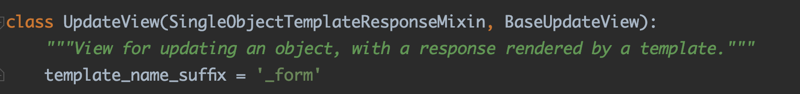

# 第5章探究CBV视图

## **5.1数据显示视图**

​	数据显示视图是将后台的数据展示在网页上，数据主要来自模型，一共定义了四个试图类分别是RedirectView、TemplateView、ListView和DetailView，说明如下：

- RedirectView用于实现HTTP重定向，默认情况只定义GET请求的处理方法
- TemplateView是视图类的基础视图，可将数据传递给HTML模版，默认情况下只定义GET请求的处理方法
- ListView是在TemplateView的基础上将数据以列表显示，通常将某个数据表的数据以列表表示
- DetailView是在TemplateView的基础上将数据详细显示，通常获取表的单挑数据

**1.重定向视图RedirectView**


- permanet:根据属性值的真假来选择重定向方式，若为True，则状态码为302，否则状态码为301
- url： 代表重定向的路由地址
- pattern_name： 代表重定向的路由命名，如果已设置参数URL则无需设置该参数，否则提示异常信息
- query_string： 是否将当前路由地址的请求参数传递到重定向的路由地址
- get_redirect_url()： 根据属性pattern_name所指向的路由命名来生成相应的路由地址。
- get()：触发HTTP的GET请求所执行的响应处理
- 剩余的类方法head()、post()、options()、delete()、put()和patch()是HTTP的不同请求方式，他们都由get()方法完成响应处理


​	以MyDjango为例，在index/urls.py、views.py和templates/index.html中编写代码

```python
#index/urls.py
from django.urls import path
from .views import *

urlpatterns = [
    path('', index, name='index'),
    path('turnTo', trunTo.as_view(), name='turnTo')
]

#index/views.py
from django.shortcuts import render
from django.views.generic import RedirectView

def index(request):
    return render(request, 'index.html')

class turnTo(RedirectView):
    permanent = False
    url = None
    pattern_name = 'index:index'
    query_string = True

    def get_redirect_url(self, *args, **kwargs):
        print('This is a get_redirect_url')
        return super().get_redirect_url(*args, **kwargs)

    def get(self, request, *args, **kwargs):
        print(request.META.get('HTTP_USER_AGENT'))
        return super().get(request, *args, **kwargs)
    
#templates/index.html
<!DOCTYPE html>
<html>
<body>
    <h3>Hello RedirectView</h3>
    <a href="?k=1">ToTurn</a>

</body>
</html>
```

​	在index的views.py中定义了视图类turnTo，它继承父类RedirectView，对父类的属性进行重设，并将父类的类方法get_redirect_url()和get()进行重写，通过这样的方式可以对视图类进行功能扩展。定义路由的时候，若使用视图类turnTo进行实例化处理。as_view()方法可在类View里找到具体的定义过程


**2.基础视图TemplateView**

​	视图类TemplateView是所有视图类最基础的应用视图类，开发者可以直接调用应用视图类，它继承多个父类：TemplateResponseMixin、ContextMixin和View。


​	从视图类Template的源码可以看到，它只定义了类方法get()，该方法分别调用函数方法get_ocntext_data()和render_to_response()，从而完成HTTP请求的响应过程。类方法get()所调用的函数方法主要来自父类TemplateResponseMixin和ContextMixin

​	TemplateView.get():

- 视图类ContextMixin的get_context_data()方法用于获取模版上下文内容，模版上下文是将视图类里的数据传递到模版文件，再由模版文件将数据转换成HTML网页数据
- 视图类TemplateResponseMixin的render_to_response()用于实现响应处理，由响应类TemplateResponse完成


​	我们可以在视图类TemplateView的源码文件里找到视图类TempalteResponseMixin的定义过程：

- template_name：设置模版文件的文件名
- template_enginee：设置解析模版文件的模版引擎
- response_class：设置HTTP请求的响应类，一般情况下使用默认值即可
- Render_to_response()：实现响应处理，由响应类TemplateResponse完成
- get_template_names()：获取属性template_name的值


实现代码如下:

```python
#index/urls.py
from django.urls import path
from .views import *

urlpatterns = [
    path('', index.as_view(), name='index')
]

#
from django.views.generic.base import TemplateView
class index(TemplateView):
    template_name = 'index.html'
    template_engine = None
    content_type = None
    extra_context = {'title' : 'This is GET'}
    
    #override
    def get_context_data(self, **kwargs):
        context = super().get_context_data(**kwargs)
        context['value'] = 'I am MyDjango'
        return context
    
    #def http post method
    def post(self, request, *args, **kwargs):
        self.extra_context = {'title': 'This is POST'}
        context = self.get_context_data(**kwargs)
        return self.render_to_response(context)
    
    
#templates/index.html
<!DOCTYPE html>
<html>
<body>
    <h3>Hello RedirectView</h3>
    <div>{{ value }}</div>
    <br>
    <form action="" method="post">
        
        <input type="submit" value="Submit">
    </form>
</body>
</html>
```

​	上述代码是将网站首页的视图函数index改为视图类index，自定义视图类index继承视图类TemplateView：

- template_name：将模版文件index.html作为网页文件
- template_engine：设置解析模版文件的模版引擎，默认值为None，即默认使用配置文件settings.py的TEMPLATE所设置的模版引擎BACKEND
- content_type：设置响应内容的数据格式，默认值为None，即代表数据格式为text/html
- extra_context：为模版文件的上下文（模版变量）设置变量值，可将数据转换成网页数据展示在浏览器上
- get_context_data()：继承并重写视图类TemplateView的类方法，在变量context里新增数据value
- post()：自定义POST请求的处理方法，当触发POST请求时，将会重设属性extra_context的值，并调用get_context_data()将属性extra_context重新写入，从而实现动态改变模版上下文的数据内容


**3.列表视图ListView**

​	

​	可以看出ListView继承自TemplateResponseMixin、MultipleObjectMixin,和View，在这些底层类的基础上加入了模型的操作方法，所以ListView有以下属性和方法：

- Allow_empty：由MultipleObjectMixin定义，在模型查询数据不存在的情况下是否显示页面，若为False并且数据不存在，则引发404异常，默认值为True
- queryset：由MultipleObjectMixin定义，代表模型的查询对象，这是对模型对象进行查询操作所生成对查询对象
- model：由MultipleObjectMixin定义，代表模型，模型以类表示，一个模型代表一张数据表
- paginate_by：由MultipleObjectMixin定义，属性值为整数，代表每一页所显示的数据量
- paginate_orphans：由MultipleObjectMixin定义，属性值为整数，默认值为0，代表最后一页可以包含的“溢出”的数据量，防止最后一页的数据量过少
- context_object_name：由MultipleObjectMixin定义，设置模版上下文，即为模版变量进行命名
- paginator_class：由MultipleObjectMixin定义，设置分页的功能类，默认情况下使用内置分页功能django.core.paginator.Paginator
- page_kwargs：由MultipleObjectMixin定义，属性值为字符串，默认值为page，设置分页参数的名称
- ordering：由MultipleObjectMixin定义，属性值为字符串或字符串列表，主要对属性queryset的查询结果进行排序
- get_queryset()：由MultipleObjectMixin定义，获取属性queryset的值
- get_ordering()：由MultipleObjectMixin定义，获取属性ordering的值
- paginate_queryset()：由MultipleObjectMixin定义，根据属性queryset的数据来进行分页处理
- get_paginate_by()：由MultipleObjectMixin定义，获取每一页所显示的数据量
- get_paginator()：由MultipleObjectMixin定义，返回当前页数所对应的数据信息
- get_paginate_orphans()：由MultipleObjectMixin定义，获取最后一页可以包含的“溢出”的数据量
- get_allow_empty()：由MultipleObjectMixin定义，获取属性allow_empty的属性值
- get_context_object_name()：由MultipleObjectMixin定义，设置模版上下文（模版变量）的名称，若context_object_name未设置，则上下文名称将由模型名称的小写+'_list'表示，比如模型PersonInfo，其模版上下文的名称为personinfo_list
- get_context_data()：由MultipleObjectMixin定义，获取模版上下文（模版变量）的数据内容
- template_name_suffix：由MultipleObjectTemplateResponseMixin定义，设置模版后缀名，用于设置模版的模版文件
- get_template_names()：由MultipleObjectTemplateResponseMixin定义，获取属性template_name的值
- get()：由BaseListView定义，定义HTTP的GET请求的处理方法


​	由于视图类ListView需要使用模型对象，因此在MyDjango项目里定义PersonInfo模型，在index/models.py中编写一下代码

```python
#index/models.py
from django.db import models

class PersonInfo(models.Model):
    id = models.AutoField(primary_key=True)
    name = models.CharField(max_length=20)
    age = models.IntegerField()
```

​	上述代码只是搭建PersonInfo类和数据表personinfo的映射关系，但在数据库并没有生成响应的数据表。因此，下一步通过两者的映射关系在数据库里生成响应的数据表。以MySQL3为例输入指令

```shell
python manage.py makemigrations
python manage.py migrate
```


​	

​	完成上述操作后，下一步在MyDjango里使用视图类ListView，在index的views.py里定义视图类index，并重新编写模版文件index.html代码：

```python
#index/views.py
from django.views.generic import ListView
from .models import PersonInfo

class index(ListView):
    template_name = 'index.html'
    extra_context = {'title' : '人员信息表'}
    queryset = PersonInfo.objects.all()
    paginate_by = 1
```

```html
<!DOCTYPE html>
<html>
<head>
    <title>{{ title }}</title>
</head>
<body>
    <h3>{{ title }}</h3>
    <table border="1">
        
        <tr>
            <th>{{ i.name }}</th>
            <th>{{ i.age }}</th>
        </tr>
        
    </table>
    <br>
    
    <div class="pagination">
        <span class="page-links">
            
            <a href="/?page={{ page_obj.previous_page_number }}">上一页</a>
            
            
            <a href="/?page={{ page_obj.next_page_number}}">下一页</a>
            
            <br>
            <br>
            <span class="page-current">
                第{{ page_obj.number }}页,
                共{{ page.paginator.num_pages }}页.
            </span>
        </span>
    </div>
    
</body>
</html>
```

​	视图类index继承父类ListView，并且仅设置4个属性就能完成模型数据的展示。视图类ListView 虽然定义了多个属性和方法，但是大部分的属性和方法已有默认值和处理过程，这些就能满足日常的开发需求，上述的试图类index仅支持http的get请求处理，因为父类ListView有自定义的get方法，如果想让视图类index能也能够处理POS的请求，那么只需在该类下自定义POS T的方法即可。


**4.详细视图**


​	视图类DetailView的底层类由TemplateResponseMixin、ContextMixin和View组成：

- template_name_field：由SingleObjectTemplateResponseMixin定义，用于确定模版的名称
- template_name_suffix：由SingleObjectTemplateResponseMixin定义，设置模版后缀名，默认后缀是_detail，用于设置默认模版文件
- get()：由BaseDetailView定义，定义HTTP的GET请求的处理方法
- model：由SingleObjectMixin定义，代表模型，模型以类表示，一个模型代表一张数据表
- queryset：由SingleObjectMixin定义，这是对模型对象进行查询操作所生产的查询对象
- context_object_name：由SingleObjectMixin定义，设置模版上下文，即为模版变量进行命名
- slug_field：由SingleObjectMixin定义，设置模型的某个字段作为查询对象，默认值为slug
- slug_url_kwarg：由SingleObjectMixin定义，代表路由地址的某个变量，作为某个模型字段的查询范围，默认值为slug
- query_pk_and_slug：由SingleObjectMixin定义，若为True，则使用pk_url_kwarg和slug_url_kwarg同时对模型进行查询，默认值为False
- get_object()：由SingleObjectMixin定义，对模型进行单条数据查询操作
- get_queryset()：由SingleObjectMixin定义，获取属性queryset的值
- get_slug_field()：由SingleObjectMixin定义，根据属性slug_field查找与之对应的数据表字段
- get_context_object_name()：由SingleObjectMixin定义，设置模版上下文的名称，若context_object_name未设置，则上下文名称由模型名称的小写表示
- get_context_data()：由SingleObjectMixin定义，获取模版上下文的数据内容


代码实现：

```python
#index/urls.py
from django.urls import path
from .views import *

urlpatterns = [
    path('<pk>/<age>.html', index.as_view(), name='index')
]

#index/views.py
from django.views.generic import DetailView
from .models import PersonInfo

class index(DetailView):
    template_name = 'index.html'
    extra_context = {'title' : '人员信息表'}
    slug_field = 'age'
    pk_url_kwarg = 'pk'
    model = PersonInfo
```

```html
<!DOCTYPE html>
<html>
<head>
    <title>{{ title }}</title>
</head>
<body>
    <h3>{{ title }}</h3>
    <table border="1">
        <tr>
            <th>{{ personinfo.name }}</th>
            <th>{{ personinfo.age }}</th>
        </tr>
    </table>
    <br>
</body>
</html>
```

​	路由index设有两个路由变量pk和age这两个变量为模型PersonInfo的字段id和age提供查询范围。视图类index的属性model以模型PersonInfo作为查询对象；属性pk_url_kwarg和slug_url_kwarg用于获取指定的路由变量。


### **5.2数据操作视图**

​	数据操作是图示对模型进行操作，如增、删、改，从而实现Django与数据库的数据交互，操作视图有四个视图类：

- FormView视图类使用内置的表单功能，通过表单实现数据验证、响应输出等功能，用于显示表单数据
- CreateView实现模型的数据新增功能，通过内置的表单功能实现数据新增
- UpdateView实现模型的数据修改功能，通过内置的表单功能实现数据修改
- DeleteView实现模型的数据删除功能，通过内置的表单功能实现数据删除

**1.表单视图FormView**

​	视图类FormView是表单在视图里的一种使用方式，表单是收集用户信息的各种表单元素的集合，作用是实现网上的数据交互，用户在网站输入数据信息，然后提交到网站服务器端进行处理，如数据录入和用户登录注册等。


​	视图类FormView的底层是由TemplateResponseMixin、ContextMixin和View组成的，设计模式和其他视图类十分相似。

- initial：由FormMixin定义，设置表单初始化的数据
- form_class：由FormMixin定义，设置表单类
- success_url：由FormMixin定义，设置重定向的路由地址
- prefix：由FormMixin定义，设置表单前缀（即表单在模版的上下文），可在模版里生成表格数据
- get_initial()：由FormMixin定义，获取表单初始化的数据
- get_prefix()：由FormMixin定义，获取表单的前缀
- get_form_class()：由FormMixin定义，获取表单类
- get_form()：由FormMixin定义，调用get_form_kwargs()完成表单类的实例化
- get_form_kwargs()：由FormMixin定义，执行表单实例化的过程
- get_success_url()：由FormMixin定义，获取重定向的路由地址
- form_valid()：由FormMixin定义，表单有效将重定向到指定的路由地址
- get_context_data()：由FormMixin定义，获取模版上下文（模版变量）的数据内容
- get()：由ProcessFormView定义，定义HTTP的GET请求的处理方法
- post()：由ProcessFormView定义，定义HTTP的POST请求的处理方法

代码实现如下：

```python
#index/urls.py
from django import forms
from .models import PersonInfo
class PersonInfo(forms.ModelForm):
	#
    class Meta:
        model = PersonInfo
        fields = '__all__'
#index/urls.py
from django.urls import path
from .views import *

urlpatterns = [
    path('', index.as_view(), name='index'),
    path('result', result, name='result')
]

#index/views.py
from django.views.generic.edit import FormView
from .form import PersonInfoForm
from django.http import HttpResponse

def result(request):
    return HttpResponse('Success')
    
class index(FormView):
    initial = {'name': 'Betty', 'age': 20}
    template_name = 'index.html'
    success_url = '/result'
    form_class = PersonInfoForm
    extra_context = {'title': '人员信息表'}
```

```html
<!DOCTYPE html>
<html>
<head>
    <title>{{ title }}</title>
</head>
<body>
    <h3>{{ title }}</h3>
    <form method="post">
        
        {{ form.as_p }}
        <input type="submit" value="确定">
    </form>
</body>
</html>
```

​	上述代码是视图类FormView的简单应用，它涉及模型和表单的使用，说明：

- index的form.py里定义了表单类PersonInfoForm，该表单是根据模型PersonInfo定义的模型表单，表单的字段来自模型的字段。
- 路由index的请求处理由视图类FormView完成，而路由result为视图类index的属性success_url提供路由地址
- 视图类index仅设置了5个属性，属性extra_context的值对应模版的上下文title；属性form_class所设置的表单在实例化之后可在模版里使用上下文form.as_p生成表格，模版上下文form的命名是固定的，它来自类FormMixin的get_context_data()
- 在网页上单击“确定”按钮，视图类index就会触发父类FormView所定义的post()方法，然后调用表单内置的is_vaild()方法对表单数据进行验证。


**2.新增视图CreateView**


​	CreateView的底层类是由TemplateResponseMixin、ContextMixin和View组成的，整个设计共继承10个类。

- field：由ModelFormMixin定义，设置模型字段，以列表表示，每个字段代表一个列表元素，可生成表单的数据列表，为用户提供数据输入
- get_form_class：由ModelFormMixin定义，重写FormMxin的方法，根据属性fields和form_class的组合情况进行判断，从而选择表单的生成方式
- get_form_kwargs()：由ModelFormMixin定义，重写FormMixin的方法
- get_success_url()：由ModelFormMixin定义，重写FormMixin的方法，判断属性success_url是否为空，若为空，则从模型的内置方法get_absolute_url()获取重定向的路由地址
- form_vaild()：由ModelFormMixin定义，重写FormMixin的表单验证方法， 新增表单数据表保存到数据库的功能
- template_name_suffix：由ModelFormMixin定义， 设置模板的后缀名，用于设置默认的模板文件。


​	视图类CreateView有两种表单的生成方式。第一种是设置form_class，通过属性form_class指定表单对象，这种方式需要开发者自定义表单对象；第二种是设置属性model和fields，由模型对象和模型字段来生成响应的表单对象，生成的表单字段与模型的字段要求相符，可以减少异常情况，并无须开发者自定义表单对象

​	实现代码

```python
#index/views.py
from django.views.generic.edit import CreateView
from .form import PersonInfoForm
from .models import PersonInfo
from django.http import HttpResponse


def result(request):
    return HttpResponse('Success')


class index(CreateView):
    initial = {'name': 'Betty', 'age': 20}
    template_name = 'index.html'
    success_url = '/result'
    #
	form_class = PersonInfoForm
    extra_context = {'title' : '人员信息表'}
```


​	运行项目，然后在MySQL中查询表的数据

​	

**3.修改视图**

​	

代码实现:

```python
#index/urls.py
from django.urls import path
from .views import *

urlpatterns = [
    path('<age>.html', index.as_view(), name='index'),
    path('result', result, name='result')
]

#index/views.py
from django.views.generic.edit import UpdateView
from .models import PersonInfo
from django.http import HttpResponse


def result(request):
    return HttpResponse('Success')

class index(UpdateView):
    template_name = 'index.html'
    success_url = '/result'
    model1 = PersonInfo
    fields = ['name', 'age']
    slug_url_kwarg = 'age'
    slug_field = 'age'
    context_object_name = 'personinfo'
    extra_context = {'title' : '人员信息表'}
```


```html
<!DOCTYPE html>
<html>
<head>
    <title>{{ title }}</title>
</head>
<body>
    <h3>{{ title }} - {{ personinfo.name }}</h3>
    <form method="post">
        
        {{ form.as_p }}
        <input type="submit" value="确定">
    </form>
</body>
</html>
```

​	在网页中修改zs的年龄，然后再去mysql中查看信息	


**4.删除视图DeleteView**

​	

​	试图类DeleteView只能删除单条数据，路由变量为模型主键提供查询范围，因为模型主键具有唯一性，所以通过主键查询能精准到某条数据，查询出来的数据通过post请求实现数据删除，删除过程由类DeletionMixin的delete()方法完成

​	代码实现:

```python
#index/urls.py
from django.urls import path
from .views import *

urlpatterns = [
    path('<pk>.html', index.as_view(), name='index'),
    path('result', result, name='result')
]

#index/views.py
from django.views.generic.edit import UpdateView, DeleteView
from .models import PersonInfo
from .form import PersonInfoForm
from django.http import HttpResponse


def result(request):
    return HttpResponse('Success')


class index(DeleteView):
    # initial = {'name': 'Betty', 'age': 20}
    template_name = 'index.html'
    success_url = '/result'
    model = PersonInfo
    queryset = PersonInfo.objects.all()
    context_object_name = 'personinfo'
    extra_context = {'title' : '人员信息表'}
```


```html
<!DOCTYPE html>
<html>
<head>
    <title>{{ title }}</title>
</head>
<body>
    <h3>{{ title }} - {{ personinfo.name }}</h3>
    <form method="post">
        
        <div>删除{{ personinfo.name }}?</div>
        <input type="submit" value="确定">
    </form>
</body>
</html>
```


