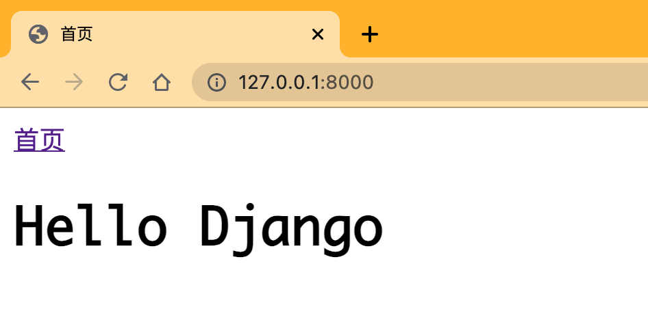
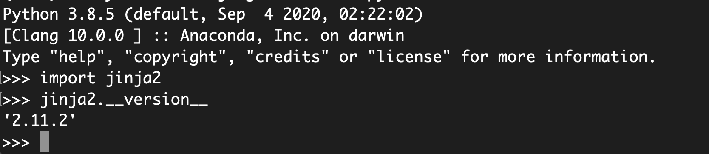

# 第6章深入模版

​	Django作为Web框架，需要一种很便利的方法动态地生存HTML网页，因此有了模版。模版包含所需HTML的部分代码以及一些特殊语法，特殊语法用于描述如何将视图传递的数据动态插入HTML网页中

## **6.1Django模版引擎**

​	Django内置的模版引擎包含模版上下文、标签和过滤器

- 模版上下文是以变量的形式写入模版文件里面，变量值由视图函数或视图类传递所得
- 标签是对模版上下文进行控制输出，比如模版上下文的判断额循环控制等
- 模版继承隶属于标签，它是将每个模版文件重复的代码抽取出来并写在一个共用模版文件，其他模版文件通过继承共用模版文件来实现完整的网页输出
- 过滤器是对模版上下文的进行操作处理，比如模版上下文的内容截取、替换或格式转换等


**1.模版上下文**

​	模版上下文是模版中基本的组成单位，上下文的数据由视图函数或视图类传递。它以{{ variable }}表示，variable是上下文的名称，他支持python所有的数据类型

```python
#if variable1 = 'stringOrInteger'
<div>{{ variable1 }}</div>
#output:<div>stringOrInteger<div>

#if variable2 = {'name': 'DictOrObject'}
<div>{{ variable2.name }}</div>
#output:<div>DictOrObject</div>

#if varaible3 = ['listOrTuple']
<div>{{ variable3.0 }}</div>
#output:<div>listOrTuple</div>
```

**2.自定义标签**

​	标签是对模版上下文进行控制输出，它是以表示的，其中tag是标签的名称，Django内置了许多模版标签

| 标签            | 描述                                             |
| --------------- | ------------------------------------------------ |
|          | 遍历输出上下文的内容                             |
|           | 对上下文进行条件判断                             |
|   | 生成csrf_token的标签，用于防护跨站请求伪造攻击   |
|          | 引用路由配置的地址，生成相应的路由地址           |
|         | 将上下文重新命名                                 |
|         | 加载导入Django的标签库                           |
|       | 读取静态资源的文件内容                           |
|  | 模版继承，xxx为模版文件名，使当前模版继承xxx模版 |
|    | 重写父类模版代码                                 |


```python
#for标签

{{ item }}


#if标签

{{ name }}

{{ name }}

{{ name }}


#url
<a href="">首页</a>
<a href="">第1页</a>

#with

{{ total }}


#load


#static

```

​	for标签模版变量说明

| 变量                 | 描述                                        |
| -------------------- | ------------------------------------------- |
| forloop.counter      | 获取当前循环的索引，从1开始计算             |
| forloop.counter()    | 获取当前循环的索引，从0开始计算             |
| forloop.revcounter   | 索引从最大数开始递减，直到索引到1位置       |
| forloop.revcounter() | 索引从最大数开始递减，直到索引到0位置       |
| forloop.first        | 当遍历的元素为第一项时为真                  |
| forloop.last         | 当遍历的元素为最后一项时为真                |
| forloop.parentloop   | 当嵌套的for循环中，获取上层for循环的forloop |

　

```python


<span>这是第一次循环</span>

<span>这是最后一次循环</span>


```


**3.模版继承**

​	模版继承时通过模版标签来实现的，其作用是将多个模版文件的共同代码集中在一个新的模版文件中，然后各个模版可以直接调用新的模版文件，从而生成HTML网页

​	templates/base.html:

```html
<!DOCTYPE html>
<html lang="en">
<head>
    <meta charset="UTF-8">
    
        <title>首页</title>
    
</head>
<body>

</body>
</html>
```

​	templates/index.html:

```html


<a href="">首页</a>
<h1>Hello Django</h1>

```

​	模版index.html调用共用模版base.html的实质是由模版继承实现的，调用步骤如下：

- 在模版index.html中使用来继承模版base.html的所有代码
- 通过使用标签或来重写模版base.html的网页内容
- 如果没有使用标签block重写共用模版的内容，网页内容将由共用模版



**4.自定义过滤器**	

​	过滤器主要是对上下文的内容进行操作处理，如替换、反序和转义等。通过过滤器处理上下文可以将其数据格式或内容转换为我们想要的显示效果，而且相应减少视图的代码量。


​	内置过滤器

| 内置过滤器       | 使用形式                                                     | 说明                                                         |
| ---------------- | ------------------------------------------------------------ | ------------------------------------------------------------ |
| add              | {{value \| add:"2}}                                          | 将value的值增加2                                             |
| addslahes        | {{value \| addslashes }}                                     | 在value的引号前增加反斜线                                    |
| capfirst         | {{value \| capfirst}}                                        | value的第一个字符转化成大写形式                              |
| cut              | {{value \| cut:arg}}                                         | 从value中删除所有arg的值。                                   |
| date             | {{value \| date:"D d M Y"}}                                  | 将日期按照指定形式输出                                       |
| default          | {{value \| default:"nothing"}}                               | 如果value的意义是False，那么输出值为过滤器设定的默认值       |
| default_if_none  | {{value \| default_if_none:"null"}}                          | 如果value的意义是None，那么输出值为过滤器设定的默认值        |
| dictsort         | {{value \| distort:"name"}}                                  | 如果vlaue的值是一个列表，里面的元素是字典，那么返回值按照每个字典的关键字排序 |
| dictsortreversed | {{value \| dictsortreversed:"name"}}                         | 如果vlaue的值是一个列表，里面的元素是字典，那么返回值按照每个字典的关键字反序排序 |
| divisibleby      | {{value \| divisibly:arg}}                                   | 如果value能够被arg整除，那么返回值将是True                   |
| escape           | {{value \| escape}}                                          | 控制HTML转义，替换value中的某些HTML特殊字符                  |
| escapejs         | {{value \| escapejs}}                                        | 替换value中的某些字符，以适应JavaScript和JSON格式            |
| filesizeformat   | {{value \| filesizeformat}}                                  | 格式化value，使其成为易读的文件大小                          |
| first            | {{value \| first}}                                           | 返回列表中的第一个Item                                       |
| floatformat      | {{value \| floatformat}}或{{value \| floatformat:arg}}       | 如果value中有非ASCII字符，那么将其转化成URL中的适合的编码    |
| join             | {{value \| join:"arg"}}                                      | 使用指定的字符串连接一个list                                 |
| last             | {{value \| last}}                                            | 返回列表中的最后一个Item                                     |
| length           | {{value \| length}}                                          | 返回value的长度                                              |
| length_is        | {{value \| length_is:"arg"}}                                 | 如果value的长度等于arg                                       |
| linebreaks       | {{value \| linebreaks}}                                      | value中的"\n"将被< br/ >替代,并且将整个value使用p标签包围起来，从而适合HTML的格式 |
| linebreakbr      | {{value \| linebreakbr}}                                     | 为显示的文本添加行数                                         |
| ljust            | {{value \| ljust}}                                           | 以左对齐方式显示value                                        |
| center           | {{value \| center}}                                          | 以居中对齐方式显示value                                      |
| rjust            | {{value \| rjust}}                                           | 以右对齐方式显示value                                        |
| lower            | {{value \| lower}}                                           | 将一个字符串转换成小写形式                                   |
| make_list        | {{value \| make_list}}                                       | 将value转换成list                                            |
| pluralize        | {{value \| pluralize}}或{{value \| pluralize:"es"}}或{{value \| pluralize:"y,ies"}} | 将value返回英文复数形式                                      |
| random           | {{value \| random}}                                          | 从给定的list中返回一个任意的Item                             |
| removetags       | {{value \| removetags:"tag1 tag2..."}}                       | 删除value中的tag1，tag2...的标签                             |
| safe             | {{value \| safe}}                                            | 关闭HTML转义，告诉Django这段代码是安全的                     |
| safesq           | {{value \| safesq}}                                          | 与上个基本相同，但是是针对多个字符串 组成的sequence          |
| slice            | {{some_list \| slice:":2"}}                                  | 与Python语法的slice相同                                      |
| slugify          | {{value \| slugify}}                                         | 将value转换成小写形式，同时删除所有分单词字符，并将空格变成横线。 |
| striptags        | {{value \| striptags}}                                       | 删除value中的所有HTML标签                                    |
| time             | {{value \| time:"H:i"}}或{{value \| time}}                   | 格式化时间输出，如果time后面没有格式化参数，那么输出按照默认设置的进行 |
| truncatewords    | {{value \| truncate words:2}}                                | 将value进行单词截取处理，参数2代表截取前两个单词，此过滤器只可截取英文截取。 |
| upper            | {{value \| upper}}                                           | 转换一个字符串为大写形式                                     |
| urlencode        | {{value \| urlencode}}                                       | 将字符串进行URLEncodec处理                                   |
| urlize           | {{value \| urlize}}                                          | 将一个字符串中的URL转化成可点击的形式                        |
| wordcount        | {{value \| wordcount}}                                       | 返回字符串中单词的数目                                       |
| wordwrap         | {{value \| word-wrap:5}}                                     | 按照指定长度分割字符串                                       |
| timesince        | {{value \| time since:arg}}                                  | 返回参数arg到value的天数和小时数                             |
| timeuntil        | {{value \| timeuntil}}                                       | 返回value距离当前日期的天数和小时数                          |


## **6.2Jinja2模版引擎**

​	Jinja2时Python里面被广泛应用的模版引擎，它的设计思想来源于Django的模版引擎，并扩展了其语法和一系列强大的功能。其中最显著的是增加了沙箱执行功能和可选的自动转义功能，同时还具备一下特性：

- 沙箱执行模式，模版的每个部分都在引擎的监督之下执行，模版将会被明确地标记在白名单或黑名单内，这样对那些不信任的模版也可以执行
- 强大的自动HTML转义系统，可以有效地阻止跨站脚本攻击
- 模版继承机制，此机制可以使得所有模版具有相似一致的布局，也方便开发人员对模版进行修改和管理
- 高效的执行效率，Jinja2引擎在模版第一次加载时就把源码转换成Python字节码，加快模版执行时间
- 调试系统融合了标准的Python的TrackBack功能，使得模版编译和运行期间的错误能及时被发现和调试
- 语法配置，可以重新配置Jinja2，使得它更好地适应LaTeX或JavaScript的输出
- 官方文档手册


**1.安装与配置**

```
pip install Jinja2
```

​	安装完成之后，在终端中进入Python交互环境，验证安装是否成功

​	

​	Jinja2安装成功后，接着Django里配置Jinja2模版。由于Django的内置功能是使用Django的模版引擎，如果将整个项目都改为Jinja2模版引擎，就会导致内置功能无法正常使用。这种情况，只能将两个模版引擎共存在同一个项目里

​	以MyDjango为例，在MyDjango文件夹里创建jinja2.py文件，在文件中定义函数environment，并在函数里使用Jinja2的类Environment进行实例化。

```python
#MyDjango/jinja2.py
from django.contrib.staticfiles.storage import staticfiles_storage
from django.urls import reverse
from jinja2 import Environment

def environment(**options):
    env = Environment(**options)
    env.globals.update({
        'static': staticfiles_storage.url,
        'url': reverse,
    })
    return env
```

​	下一步将jinja2.py文件定义的函数environment写到配置文件settings.py，否则jinja2.py文件所定义的函数无法作用在MyDjango项目里。在配置属性TEMPLATE中新增Jinja2模版引擎，代码如下:

```python 
TEMPLATES = [
    {
        'BACKEND': 'django.template.backends.jinja2.Jinja2',
        'DIRS': [os.path.join(BASE_DIR, 'templates'),
                 ],
        'APP_DIRS': True,
        'OPTIONS': {
            'context_processors': [
                'django.template.context_processors.debug',
                'django.template.context_processors.request',
                'django.contrib.auth.context_processors.auth',
                'django.contrib.messages.context_processors.messages',
            ],
        },
    },
    {
            'BACKEND': 'django.template.backends.django.DjangoTemplates',
            'DIRS': [],
            'APP_DIRS': True,
            'OPTIONS': {
                'context_processors': [
                    'django.template.context_processors.debug',
                    'django.template.context_processors.request',
                    'django.contrib.auth.context_processors.auth',
                    'django.contrib.messages.context_processors.messages',
                ],
            },
        },
]

```

​	配置属性TEMPLATES是以列表形式表示的，列表里定义了两个元素，每个元素是以字典形式表示的，说明如下：

- 第一个列表元素设置Jinja2模版引擎，属性OPTIONS的environment是MyDjango文件夹的jinja2.py问价所定义的函数environment，并且属性DIRS指向项目里的模版文件夹templates，这说明模版文件夹templates里的所有模版文件皆由Jinja2模版引擎执行解析处理
- 第二个列表元素设置Django的模版引擎，属性OPTIONS的context_processors代表Django的内置功能，如Admin后台系统、信息提示和认证系统等。


​	在MyDjango的urls.py、index的urls.py、views.py和模版文件index.html中编写代码：

```python
#MyDjango/urls.py
from django.urls import path, re_path, include
from django.contrib import admin
urlpatterns = [
    path('admin/', admin.site.urls),
    path('', include(('index.urls', 'index'), namespace='index')),
]

#index/urls.py
from django.urls import path
from . import views

urlpatterns = [
    path('', views.index, name='index' )
]

#index/views.py
from django.shortcuts import render

def index(request):
    value = {'name': 'This is Jinja2'}
    return render(request, 'index.html', locals())

```

```html


    <title>Jinja2</title>


    <div>
        {{ value['name'] }}
    </div>

```

