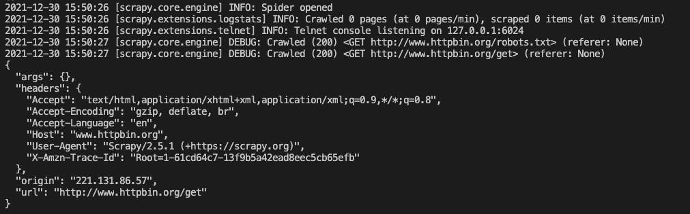

# 5.1使用说明
需要说明的是，Scrapy已经提供了许多Downloader Middleware，比如负责失败重试、自动重定向等功能的Downloader Middleware，它们被`DOWNLOADER_MIDDLEWARES_BASE`变量所定义  
DOWNLOADER_MIDDLEWARES_BASE变量的内容如下  
```python
{
    "scrapy.downloadermiddlewares.robotstxt.RobotsTxtMiddleware":100,
    "scrapy.downloadermiddlewares.httpauth.HttpAuthMiddleware":300,
    "scrapy.downloadermiddlewares.downloadtimeout.DownloadTimeoutMiddleware":350,
    "scrapy.downloadermiddlewares.defaultheaders.DefaultHeadersMiddleware":400,
    "scrapy.downloadermiddlewares.useragent.UserAgentMiddleware":500,
    "scrapy.downloadermiddlewares.retry.RetryMiddleware":550,
    "scrapy.downloadermiddlewares.ajaxcrawl.AjaxCrawlMiddleware":560,
    "scrapy.downloadermiddlewares.redirect.MetaRefreshMiddleware":580,
    "scrapy.downloadermiddlewares.httpcompression.HttpCompressionMiddleware":590,
    "scrapy.downloadermiddlewares.redirect.RedirectMiddleware":600,
    "scrapy.downloadermiddlewares.cookies.CookiesMiddleware":700, 
    "scrapy.downloadermiddlewares.httpproxy.HttpProxyMiddleware":750, 
    "scrapy.downloadermiddlewares.stats.DownloaderStats": 850,
    "scrapy.downloadermiddlewares.httpcache.HttpCacheMiddleware": 900
}
```
这是一个字典格式，字典的键名是Scrapy内置的Downloader Middleware的名称，键值代表了调用的优先级，优先级是一个数字，数字越小代表越靠近Engine，数字越大代表越靠近Downloader。  
在默认情况下，Scrapy已经为我们开启了`DOWNLOADER_MIDDLEWARES_BASE`所定义的Downloader Middleware，比如RetryMiddleware带有自动重试功能，RedirectMiddleware带有自动处理重定向功能，这些功能默认都是开启的。  
其实每个Downloader Middleware都可以通过定义`process_request`和`process_response`方法来分别处理Request和Response，被开启的Downloader Middleware的`process_request`方法和`process_response`方法会根据优先级被顺次调用。

由于Request是从Engine发送给Downloader的，并且优先级数字越小的Downloader Middleware越靠近Engine，所以优先级数字越小的Downloader Middleware的`process_request`方法越先被调用`process_response`方法则相反，由于Response是由Downloader发送给Engine的，优先级数字越大的Downloader Middleware越靠近Downloader，所以优先级数字越大的Downloader Middleware的`process_response`越先被调用。

# 5.2核心方法
Scrapy内置的Downloader Middleware为Scrapy提供给了基础的功能，但在项目实战中，我们往往需要单独定义Downloader Middleware。
每个Downloader Middleware都定义了一个或多个方法的类，核心方法有如下3个：
- process_request(request, spider)
- process_response(request, response, spider)
- process_exception(request, exception, spider)

我们只需要实现至少一个方法，就可以定义一个Downloader Middleware。

- **process_request(request, spider)**  
 Request被Engine发送给Downloader之前，`process_request`方法就会被调用，也就是在Request从Scheduler里被调度出来发送到Downloader下载之前们，我们都可以用`process_request`方法对Request进行处理。  
 这个方法的返回值必须为None、Response对象、Request对象三者之一，或者抛出IgnoreRequest异常。

    process_request方法的参数有两个。
    - request：Request对象，即被处理的Request
    - spider：Spider对象，即此Request对应的Spider对象

    返回类型不同，产生的效果也不同。
    - 当返回的是None时，Scrapy将继续处理该Request，接着执行其他Downloader Middleware的`process_request`方法，一直到Downloader Middleware把Request执行得到Response才结束。这个过程其实就是修改Request的过程，不同的Downloader Middleware按照设置的优先级顺序依次对Request进行修改，最后送至Downloader执行
    - 当返回为Response对象时，更低优先级的Downloader Middleware的`process_request`和`process_exception`方法就不会被继续调用，每个Downloader Middleware的`process_response`方法转而被依次调用。调用完毕后，直接将Response对象发送给Spider处理
    - 当返回为Request对象时，更低优先级的Downloader Middleware的`process_request`方法会停止执行。这个Request会重新放到调度队列里，其实它就是一个全新的Request，等待被调度。如果被Scheduler调度了，那么所有的Downloader Middleware的`process_request`方法会被重新按照顺序执行。  
    - 如果抛出IgnoreRequest异常，则所有的Downloader Middleware的`process_exception`方法会依次执行。如果没有一个方法处理这个异常，那么Request的errorback方法会回调。如果该异常还没有被处理，那么它便会被忽略

- **process_response(request, response, spider)**  
Downloader执行Request下载之后，会得到对应的Response。Engine便会将Response发送给Spider进行解析。在发送给Spider，我们都可以用`process_response`方法来对Response进行处理。`process_response`方法的返回值必须为Request对象和Response对象两者之一，或者抛出IgnoreRequest异常。

    process_response方法的参数有3个。
    - request：Request对象，即此Response对应的Request
    - response：Response，即被处理的Response
    - Spider：Spider对象，即此Response对应的Spider对象

    下面对不同的返回值情况做一下归纳
    - 当返回为Request对象时，更低优先级的Downloader Middleware的`process_response`方法不会继续调用。该Response对象会重新放到调度队列里等待被调度，相当于全新的Request，然后。该Request会被`process_request`方法顺次处理
    - 当返回的为Response对象时，更低优先级的Downloader Middleware的`process_response`方法会继续被调用，对该Response对象进行处理。
    - 如果抛出IgnoreRequest异常，则Request的errorback方法会回调。如果该异常还没有被处理，那么它会被忽略

- `process_exception(request, exception, spider)`  
当Downloader或`process_request`方法抛出异常时，例如抛出IgnoreRequest方法会被调用。方法的返回值必须为None、Response对象、Request对象三者之一

    process_exception方法的参数有3个
    - request：Request对象，即产生异常的Request
    - exception：Exception对象，即抛出的异常
    - spider：Spider对象，即Request对应的Spider

    下面归纳不同的返回值
    - 当返回为None时，更低优先级的Downloader Middleware的`process_exception`方法会被继续顺次调用，知道所有方法都被调用完毕
    - 当返回为Response对象时，更低优先级的Downloader Middleware的`process_exception`方法不再被继续调用，该Request会重新方法放到调度队列里面等待被调度，相当于一个全新的Request。然后，该Request又会被`process_request`方法顺次处理。


# 5.3项目实战
首先，我们新建一个Scrapy项目，名字叫做scrapydownloadermiddlewaredemo，命令如下：  
`scrapy startproject scrapydownloadermiddlewaredemo`

命令执行完毕后，就新建一个Spider，叫做httpbin
接下来我们修改start_url为`['http://www.httpbin.org/get']`.随后将parse方法添加一行打印输出，将response变量的text属性输出，这样我们便可以看到Scrapy发送的Request信息了。

修改内容如下所示：
```python
import scrapy

class HttpbinSpider(scrapy.Spider):
    name = 'httpbin'
    allowed_domains = ['www.httpbin.org']
    start_urls = ['http://www.httpbin.org/get']

    def parse(self, response):
        print(response.text)
```

接下来运行此Spider，执行如下命令：  
`scrapy crawl httpbin`

Scrapy的运行结果包含Scrapy发送的Request信息，如下所示



我们观察一下headers，Scrapy发送的Request使用的User-Agent是Scrapy/2.2.1(+https://scrapy.org)，这其实是由Scrapy内置的UserAgentMiddleware设置的，UserAgentMiddleware的源码如下所示：
```python 
from scrapy import signals

class UserAgentMiddleware(object):
    def __init__(self, user_agent='Scrapy'):
        self.user_agent = user_agent

    @classmethod 
    def from_crawler(cls, crawler):
        o = cls(crawler.settings['USER_AGENT'])
        crawler.signals.connect(o.spider_opened, signal=signals.spider_opened)
        return o

    def spider_opened(self, spider):
        self.user_agent = getattr(spider, 'user-agent', self.user_agent)

    def process_request(self, request, spider):
        if self.user_agent:
            request.headers.setdefault(b'User-Agent', self.user_agent)
```
在`from_crawler`方法中，UserAgentMiddleware首先尝试获取settings里面的USER_AGENT，然后把USER_AGENT传递给__init__方法进行初始化，其参数就是user_agent。如果没有传递USER_AGENT参数，就会默认将其设置为Scrapy字符串。我们新建的项目没有USER_AGENT，所以这里的user_agent变量就是Scrapy。

接下来，在`process_request`方法中，将user-agent变量设置为headers变量的一个属性，这样就成功设置了User-Agent。因此，User-Agent就是通过此Download Middleware的process_request方法设置的，这就是一个典型的Downloader Middleware的实例。我们再看一下DOWNLOAD_MIDDLEWARES_BASE的配置，UserAgentMiddleware的配置如下：
```python
{
    'scrapy.downloadermiddlewares.useragent.UserAgentMiddleware': 500
}
```

可以看到，UserAgentMiddleware被配置了在默认的DOWNLOAD_MIDDLEWARES_BASE里，优先级为500，这样每次Request在被Downloader执行前都会被UserAgentMiddleware的process_request方法加上默认的User-Agent/

但是如果这个默认的User-Agent直接去请求目标网站，很容易被检测出来，我们需要把User-Agent改为常见的浏览器User-Agent。修改方式有：
- 修改settings里面的USER_AGENT变量
- 通过Downloader Middleware的process_request方法来修改
