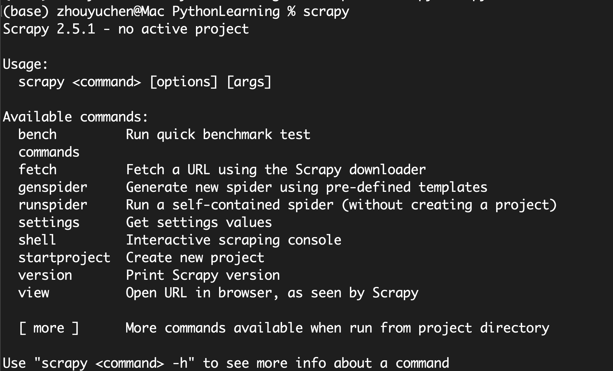
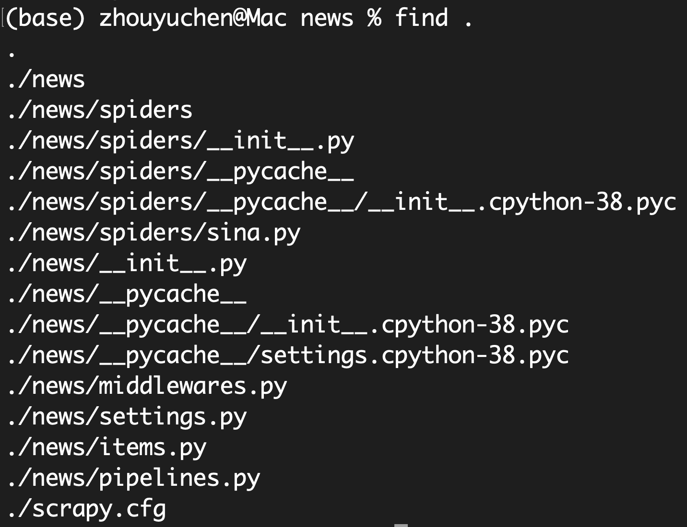

# 1.1简介
通常我们在用requests时，实现爬虫相关的所有操作，例如爬取逻辑、异常处理、数据存储、数据解析等，但其实这些步骤很多都是重复的。既然如此，我们将这些步骤的逻辑抽离出来，把其中的通用功能做成一个个基础组件。Scrapy框架几乎是Python爬虫学习和工作过程中必须掌握的框架，需要好好钻研和掌握。

参考文档：
- 官网:https://scrapy.org/
- 文档:https://docs.scrapy.org/
- GitHub:https://github.com/scrapy/scrapy

# 1.2架构

- Engine：引擎，图最中间的部分，用来处理整个系统的数据流和事件，是整个框架的核心，可以理解为整个框架的中央处理器，负责数据的流转和逻辑的处理。
- Item：它是一个抽象的数据结构，所以图中没有体现出来，它定义了爬取结果的数据结构，爬取的数据会被赋值成Item对象。每个Item就是一个类，类里面定义了爬取结果的数据字段，可以理解为它用来规定爬取数据的存储格式
- Scheduer：调度器，图中下方的部分，用来接受Engine发过来的Request并将其加入队列中，同时也可以将Request发回给Engine供Donwloader执行，它主要维护了Request的调度逻辑，比如先进先出、先进后出、优先级进出等等。
- Spiders：蜘蛛，图中上方部分，其可以对应多个Spider，每个Spider里面定义了站点的爬取逻辑和页面的解析规则，他主要负责解析响应并生成Item和新的请求然后发给Engine进行处理。
- Downloader：下载器，图中右侧部分，即可完成“向服务器发送请求，然后拿到响应”的过程，得到的响应会再发送给Engine处理。
- Item Pipelines：项目管道，图中左侧部分，可以对应多个Item Pipeline。Item Pipeline主要负责由Spider从页面中抽取的Item，做一些数据清洗、验证和存储等工作，比如将Item的某些字段进行规整，将Item存储到数据库等操作都可以由Item Pipeline来完成。
- Download Middlewares：下载器中间件，图中Engine和Downloader之间的Hook框架，负责实现Downloader和Engine之间的请求和响应的处理过程。
- Spider Middlewares：蜘蛛中间件，图中Engine和Spiders之间的方块部分，他是位于Engine和Spiders之间的Hook框架，负责实现Spiders和Engine之间的Item，请求和响应的处理过程。

# 1.3数据流
了解了Scrapy的基本组件和功能后，通过图和描述我们可以知道，在整个爬虫的过程中，Engine负责了整个数据流的分配和处理，数据流主要包括Item、Request、Response这三大部分。接下来我们看看数据流是怎么被Engine控制的

(1)启动爬虫项目时，Engine根据要爬取的目标站点找到处理该站点的Spider，Spider会生成最初需要爬取的页面对应的一个或多个Request，然后发送给Engine。  
(2)Engine从Spider中获取这些Request，然后把他们交给Scheduler等待被调度。  
(3) Engine向Scheduler索取下一个要处理的Request，这时候Scheduler根据其调度逻辑选择最合适的Request发送给Engine。  
(4)Engine将Scheduler发来的Request转发给Downloader进行下载执行，将Request发送给Downloader的过程会经由许多定义好的Downloader Middlewares的处理  
(5)Downloader将Request发送给目标服务器，得到对应的Response，然后将其返回给Engine。将Response返回给Engine的过程中同样也会经由许多定义好的Downloader Middlewares的处理。  
(6)Engine从Downloader处接收到的Response里包含了爬取的目标站点的内容，Engine会将此Response发送给对应的Spider进行处理，将Response发送给Spider的过程中会经由定义好的Spider Middlewares的处理。
(7)Spider处理Response，解析Response的内容，这时候Spider会产生一个或多个爬取结果Item或者后续要爬取的目标页面对应的一个或多个Request，然后再将这些Item或Request发送给Engine进行处理，将Item或Request发送给Engine的过程会经由定义好的Spider Middlewares的处理。
(8)Engine将Spider发回的一个或多个Item转发给定义好的Item Pipelines进行数据处理或存储的一系列操作，将Spider发回的一个或多个Request转发给Scheduler等待下一次被调度

重复(2)到(8)到操作，知道Scheduler中没有更多的Request，这时候Engine会关闭Spider，整个爬取过程结束

# 1.4项目结构
在开始之前，得先安装Scrapy，可以使用下面这行代码  
`pip install scrapy`
不过，Scrapy框架往往需要很多依赖库，如果依赖库没有安装好的话，容易安装失败。安装成功后，我们就可以使用Scrapy命令行了，在命令行中输入`scrapy`就可以看到

Scrapy可以通过命令行来创建一个爬虫项目，比如我们要创建一个专门用来爬取新闻的项目，取名为news，那么可以执行以下命令  
`scrapy startproject news`  
接着进入news文件夹，我们可以再用命令行创建一个Spider用来专门爬取某个站点的新闻，比如新浪新闻  
`scrapy genspider sina news.sina.com.cn`  
现在项目结构如下：
  

各个主要文件的功能描述如下:
- scrapy.cfg：Scrapy项目的配置文件，其中定义了项目的配置文件路径、部署信息等。
- items.py：定义了Item数据结构，所有Item的定义都可以放在这里。
- pipelines.py：定义了Item Pipelin的实现，所有的Item Pipeline的实现都可以放在这里。
- settings.py：定义了项目的全局配置。
- middlewares.py：定义了Spider Middlewares和Downloader Middlewares的实现。
- spiders：里面包含了一个个Spider的实现、每个Spider都对应了一个Python文件

# 1.5总结
本节介绍了Scrapy框架的基本架构、数据流过程以及项目结构