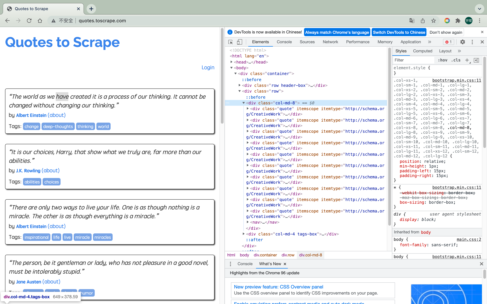
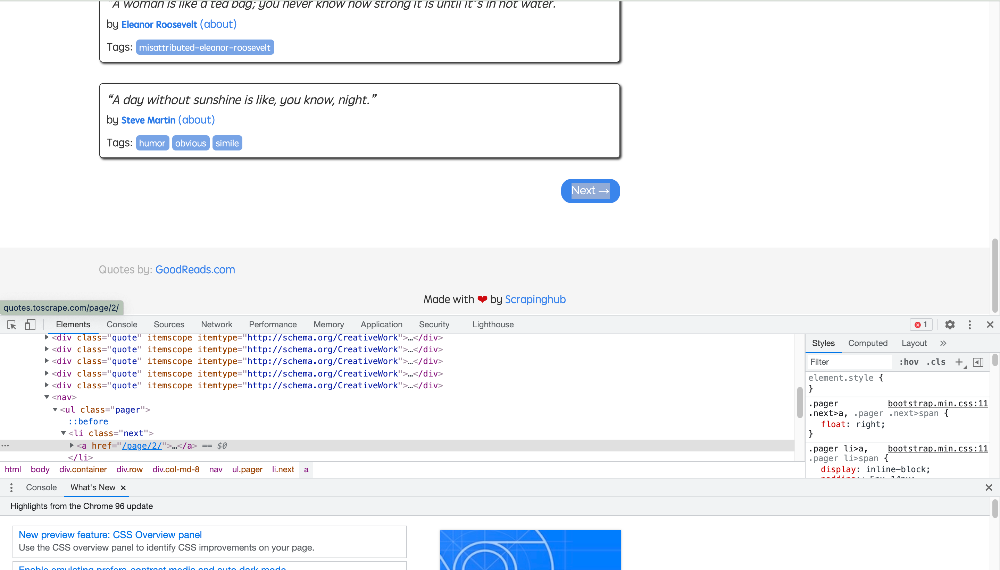
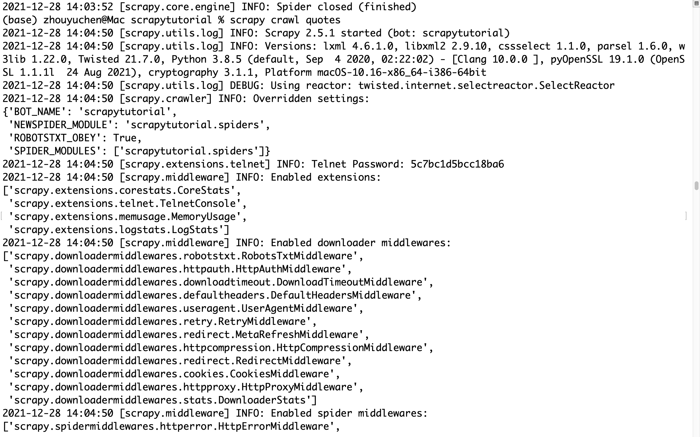

# 2.1本节目标
在这一节中，你需要学会
- 创建一个Scrapy项目，熟悉Scrapy项目的创建流程。  
- 编写一个Spider来抓取站点和处理数据，了解Spider的基本特性
- 初步了解Item Pipeline的功能，将抓取的内容保存到MongoDB数据库中。
- 运行Scrapy爬虫项目，了解Scrapy项目的运行流程

这里我们以Scrapy推荐的官方练习项目为例进行实战演练，抓取目标站点为http://quotes.toscrape.com/


这个站点包含一系列名人名言、作者和标签，我们需要使用Scrapy将其中的内容爬取并保存下来

# 2.2准备工作
在开始之前，我们需要安装好Scrapy框架、MongoDB和PyMongo库，具体安装参考：
- Scarpy:https://setup.scrape.center/scrapy
- MongoDB:https://setup.scrape.center/mongodb
- PyMongo:https://setup.scrape.center/pymongo

# 2.3创建项目
首先需要创建一个名为scrapytutorial的scrapy项目，可以直接使用命令`scrapy startproject scrapytutorial`

# 2.4创建Spider
Spider是自己定义的类，Scrapy用它来从网页里抓取内容，并解析抓取结果。不过这个类必须继承Scrapy提供的Spider类scrapy.Spider，还要定义Spider的名称和起始Request，以及怎样处理爬取后的结果的方法。  
也可以使用命令行创建一个Spider。比如，这里要创建的Spider可以用
```shell
$ cd scrapytutorial
$ scrapy gensipder quotes http://quotes.toscrape.com/
```
在spiders文件夹中多了一个quotes.py，这就是刚刚创建的Spider，内容如下：
```python
import scrapy


class QuotesSpider(scrapy.Spider):
    name = 'quotes'
    allowed_domains = ['quotes.toscrape.com']
    start_urls = ['http://http://quotes.toscrape.com//']

    def parse(self, response):
        pass

```

这个QuotesSpider就是刚刚创建的Spider，它继承了scrapy的Spider类，QuotesSpider有3个属性，分别是name、allowed_domains和start_urls，还有一个方法parse。

- name是每个项目唯一的名字，用来区分不同的Spider
- allow_domains是允许爬取的域名，如果初始或后续的请求连接不是在这个域名下的，则请求链接会被过滤掉
- start_urls包含了Spider在启动时爬取的URL列表，初始请求是由它来定义的
- parse是Spider的一个方法。在默认情况下，start_urls里面的链接构成的请求完成下载后，parse方法就会被调用，返回的响应就会作为唯一的参数传递给parse放啊。该方法负责解析返回的响应、提取数据或进一步生成要处理的请求。

# 2.5创建Item
Item是保存爬取数据的容器，定义了爬取结果的数据类型，它的使用方法与字典类似。不过Item多了保护机制，可以避免拼写错误或者定义字段错误。  
创建Item需要继承Scrapy的Item类，并且定义类型为Field类型的字段。

我们需要爬取目标网站的字段有:
- text：文本，即每条名言的内容，是一个字符串
- author：作者，即每条名言的作者，是一个字符串
- tags：标签，即每条名言的标签，是字符串组成的列表

这样的话，items.py就是下面的这种情况：
```python
import scrapy

class QuoteItem(scrapy.Item):
    text = scrapy.Field()
    author = scrapy.Field()
    tags = scrapy.Field()
```
这里我们申明了QuoteItem，继承了Item类，然后使用了Field定义了3个字段。


# 2.6解析Response
之前我们看到，parse方法的参数response是start_urls里面的链接爬取后的结果，即页面请求后得到的Response，Scrapy将其转化为了一个数据对象，里面包含了页面请求后得到的Response Status、Body等内容。所以在parse方法中，我们可以直接对response变量包含的对内容进行解析，比如浏览器请求结果的网页源代码，进一步分析源代码内容，或者找出结果中的链接而得到下一个请求。

首先看看网页结构，如下图。每一页都有多个class为quote的区块都包含text、author、tags。那么我们先找出所有的quote，然后提取每个quote的内容。



我们可以使用CSS选择器或者XPath选择器进行提取，这个过程我们可以直接借助response的css或xpath方法实现，这都是Scrapy给我封装好的方法，直接调用即可。

在这里我们使用CSS选择器进行选择，可以将parse方法进行更改：
```python
    def parse(self, response):
        quotes = response.css('.quote')
        for quote in quotes:
            item = QuoteItem()
            item['text'] = quote.css('.text::text').extract_first()
            item['author'] = quote.css('.author::text').extract_first()
            item['tags'] = quote.css('.tags .tag::text').extract()
            yield  item

```
这里首先利用CSS选择器选取所有的quote并将其赋值为quotes变量，然后利用for循环遍历每个quote，解析每个quote的内容。  

对text来说，观察它的class为text，所以可以用`.text`选择器来选取，这个结果实际上是整个带有标签的节点，要获取它的正文内容，可以加上`::text`。这时结果是长度为1的列表，所以还需要用`extract_first`方法来获取第一个元素。而对于tags来说，由于我们要获取所有的标签，所以用extract方法获取整个列表即可。  

# 2.7使用Item
我们可以把Item理解为一个字典，和字典还不太相同，其本质是一个类，所以在使用的时候需要实例化。实例化之后，我们依次用刚才解析的结果赋值Item的每一个字段，最后将Item返回。

QuotesSpider的改写如下：
```python
import scrapy
from scrapytutorial.items import QuoteItem

class QuotesSpider(scrapy.Spider):
    name = 'quotes'
    allowed_domains = ['http://quotes.toscrape.com/']
    start_urls = ['http://http://quotes.toscrape.com/']

    def parse(self, response):
        quotes = response.css('.quote')
        for quote in quotes:
            item = QuoteItem()
            item['text'] = quote.css('.text::text').extract_first()
            item['author'] = quote.css('.author::text').extract_first()
            item['tags'] = quote.css('.tags .tag::text').extract()
            yield  item

```

这样一来，首页的所有内容都被解析出来了。


# 2.8后续Request
上面的操作实现了从首页抓取内容，如果运行它，我们其实已经可以从首页提取到所有的quote信息并将其转化为一个个QuoteItem对象了。但是如何进行下一步操作，需要从当前页面中找到信息来生成下一个Request，利用同样的方式进行请求并解析就好了。将页面拉到最底部，如下图所示。



我们发现这里有一个Next按钮，可以看到他的链接是/page/2/，那么全链接就是http://quotes.toscrape.com/page/2/，通过这个链接我们就可以构造下一个Request请求了。

构造Request时需要用到scrapy的Request类。这里我们传递两个参数，分别是url和callback，说明如下：
- url：目标页面的链接
- callback：回调方法，当指定了该回调方法的Request完成下载后，获取Response，Engine会将该Response作为参数传递给这个回调方法。回调方法进行Response的解析生成一个或多个Item或Request，比如上文的parse方法就是回调方法。  

由于刚才定义的parse方法就是用来提取名言text、author、tags的方法，而下一页的结构和刚才已经解析的页面结构是一样的，所以我们可以再次使用parse方法来做页面解析

接下来我们要做的就是利用选择器得到下一页链接并生成请求，在parse方法后面追加如下代码：
```python 
next = response.css('.pager .next a::attr(href)').extract_first()
url = response.urljoin(next)
yield scrapy.Request(url=url, callback=self.parse)    
````
第一行代码首先通过css选择器获取下一个页面的链接，即要获取超链接a中的href属性，这里用到了`::attr(href)`进行提取，其中attr代表提取节点的属性，href则为要提取的属性名，然后再下一步调用`extract_first`方法获取内容。  
第二行代码调用urljoin方法，urljoin方法可以将相对URL构造成一个绝对URL。   
第三行代码通过url和callback变量构造了一个新的Request，回调方法callback依然使用parse方法。

改写之后，quotes.py文件为

```python
import scrapy
from scrapytutorial.items import QuoteItem

class QuotesSpider(scrapy.Spider):
    name = 'quotes'
    allowed_domains = ['quotes.toscrape.com']
    start_urls = ['http://http://quotes.toscrape.com/']

    def parse(self, response):
        quotes = response.css('.quote')
        for quote in quotes:
            item = QuoteItem()
            item['text'] = quote.css('.text::text').extract_first()
            item['author'] = quote.css('.author::text').extract_first()
            item['tags'] = quote.css('.tags .tag::text').extract()
            yield  item

        next = response.css('.pager .next a::attr(href)').extract_first()
        url = response.urljoin(next)
        yield scrapy.Request(url=url, callback=self.parse)
        


```

# 2.9运行
接下来就是运行项目了，进入项目目录，运行下面这行命令  
`scrapy crawl quotes`
运行完毕之后可以看到Scrapy成功爬取了http://quotes.toscrape.com/，并输出了信息。



# 2.10保存到文件
运行完Scrapy后，我们只能在控制台上看到输出结果，这时候使用下面这行命令即可输出成json格式的文件  
`scrapy crawl quotes -o quotes.json`  
最后会在该目录下出现一个json文件 

当然，scrapy也可以保存为其他格式的文件，具体命令如下：
- jsonline文件: `scrapy crawl quotes -o quotes.jl`
- csv文件:`scrapy crawl quotes -o quotes.csv`
- xml文件:`scrapy crawl quotes -o quotes.xml`
- pickle:`scrapy crawl quotes -o quotes.pickle`
- marshal:`scrapy crawl quotes -o quotes.marshal`
- ftp远程传输:`scrapy crawl quotes -o ftp:user:passwd@ip:/path/quotes.csv`

其中，ftp输出需要配置正确的用户名、密码、地址、输出路径。

# 2.11使用Item Pipeline
如果想要进行复杂的输出，可以使用Item Pipeline。
Item Pipeline为项目管道。当Item生成后，他会自动被Item Pipeline处进行处理，我们可以用Item Pipeline来做如下操作：
- 清洗HTML数据
- 验证爬取数据，检查爬取字段
- 查重并丢弃重复内容
- 将爬取结果存储到数据库

要实现Item Pipeline很简单，只需要定义一个类并且实现process_item方法即可。启用Item Pipeline后，Item Pipeline会自动调用这个方法。process_item方法必须返回包含数据的字典或Item对象，或者抛出DropItem异常。  
process_item方法有两个参数。一个参数是item，每次Spider生成的Item都会作为参数传递过来。另一个参数是spider，就是Spider的实例。接下来我们实现一个Item Pipeline筛掉text长度大于50的Item，并将结果保存到MongoDB。

修改项目里的pipelines.py文件，之前用命令行生成的文件内容可以删掉，增加一个TextPipeline类，内容如下：
```python
from scrapy.exceptions import DropItem

class TextPipeline(object):
    def __init__(self):
        self.limit = 50

    def process_item(self, item, spider):
        if item['text']:
            if len(item['text']) > self.limit:
                item['text'] = item['text'][0:self.limit].rstrip()+'...'
                return item

            else:
                return DropItem('Missing text')
```

这段代码在构造方法里定义了限制长度为50，实现了`process_item`方法，其参数是item和spider。首先该放啊判断item的text属性是否存在，如果不存在，则抛出DropItem异常。如果存在，再判断长度是否大于50，如果大于，那就截断然后拼接省略号，再将item返回。  
接下来，我们将处理后的item存入MongoDB，定义另外一个Pipeline。同样在pipelines.py中，我们实现另一个类MongoPipeline，内容如下：
```python
class MonogoDBPipeline(object):
    def __init__(self, connection_string, database):
        self.connection_string = connection_string
        self.database = database

    @classmethod
    def from_crawler(cls, crawler):
        return cls(
            connection_string = crawler.settings.get('MONGODB_CONNECTION_STRING'),
            database=crawler.settings.get('MONGODB_DATABASE')
        )
    
    def open_spider(self, spider):
        self.client = pymongo.MongoClient(self.connection_string)
        self.db = self.client[self.database]

    def process_item(self, item, spider):
        name = item.__class__.__name__
        self.db[name].insert(dict(item))
        return item

    def close_spider(self, spider):
        self.client.close()
```
MongoPipeline类实现了另外几个API定义方法：
- from_crawler:一个类方法，用`@classmethod`标识，这个方法是以依赖注入的方式实现的，方法的参数就是crawler。通过crawler，我们能拿到全局配置的每个配置信息，在全局配置settinfs.py中，可以通过定义MONGO_URI和MONGO_DB来指定MongoDB连接需要的地址和数据库名称，拿到配置系信息之后返回类对象即可。所以这个方法的定义主要是用来获取settings.py中的配置的

- open_spider:当Spider被开启时，这个方法被调用，主要进行了一些初始化操作
- close_spider:当Spider被关闭时，这个方法被调用，将数据库连接关闭

最主要的`process_item`方法则执行了数据插入操作，这里直接调用insert方法传入item对象即可将数据存储到MongoDB。  
定义好的TextPipeline和MongoDBPipeline这两个类后，我们需要在`settings.py`中使用它们。

```python
ITEM_PIPELINES = {
   'scrapytutorial.pipelines.TextPipeline': 300,
   'scrapytutorial.pipelines.MongoDBPipeline': 400,
}
MONGODB_CONNECT_STRING='localhost'
MONGODB_DATABASE = 'scrapytutorial'
```
这里我们申明了ITEM_PIPELINES字典，键名时Pipeline的类名，键值时调用优先级，是一个数字，数字越小则优先级更高，另外我们申明了MongoDB的连接字符串和存储的数据库名称。
然后再重新爬取，使用`scrapy crawl quotes`