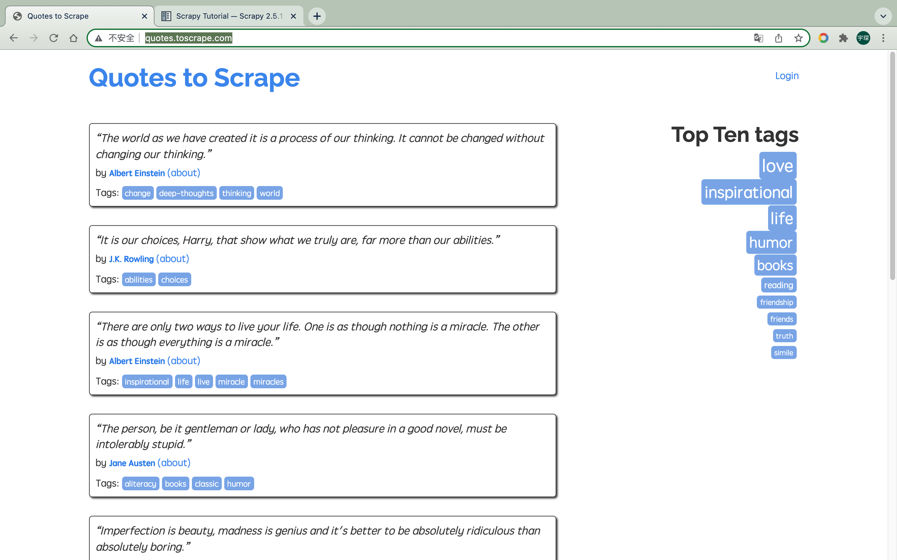

# 2.1本节目标
在这一节中，你需要学会
- 创建一个Scrapy项目，熟悉Scrapy项目的创建流程。  
- 编写一个Spider来抓取站点和处理数据，了解Spider的基本特性
- 初步了解Item Pipeline的功能，将抓取的内容保存到MongoDB数据库中。
- 运行Scrapy爬虫项目，了解Scrapy项目的运行流程

这里我们以Scrapy推荐的官方练习项目为例进行实战演练，抓取目标站点为http://quotes.toscrape.com/



这个站点包含一系列名人名言、作者和标签，我们需要使用Scrapy将其中的内容爬取并保存下来

# 2.2准备工作
在开始之前，我们需要安装好Scrapy框架、MongoDB和PyMongo库，具体安装参考：
- Scarpy:https://setup.scrape.center/scrapy
- MongoDB:https://setup.scrape.center/mongodb
- PyMongo:https://setup.scrape.center/pymongo

# 2.3创建项目
首先需要创建一个名为scrapytutorial的scrapy项目，可以直接使用命令`scrapy startproject scrapytutorial`

# 2.4创建Spider
Spider是自己定义的类，Scrapy用它来从网页里抓取内容，并解析抓取结果。不过这个类必须继承Scrapy提供的Spider类scrapy.Spider，还要定义Spider的名称和起始Request，以及怎样处理爬取后的结果的方法。  
也可以使用命令行创建一个Spider。比如，这里要创建的Spider可以用
```shell
$ cd scrapytutorial
$ scrapy gensipder quotes http://quotes.toscrape.com/
```
在spiders文件夹中多了一个quotes.py，这就是刚刚创建的Spider，内容如下：
```python
import scrapy


class QuotesSpider(scrapy.Spider):
    name = 'quotes'
    allowed_domains = ['http://quotes.toscrape.com/']
    start_urls = ['http://http://quotes.toscrape.com//']

    def parse(self, response):
        pass

```

这个QuotesSpider就是刚刚创建的Spider，它继承了scrapy的Spider类，QuotesSpider有3个属性，分别是name、allowed_domains和start_urls，还有一个方法parse。

- name是每个项目唯一的名字，用来区分不同的Spider
- allow_domains是允许爬取的域名，如果初始或后续的请求连接不是在这个域名下的，则请求链接会被过滤掉
- start_urls包含了Spider在启动时爬取的URL列表，初始请求是由它来定义的
- parse是Spider的一个方法。在默认情况下，start_urls里面的链接构成的请求完成下载后，parse方法就会被调用，返回的响应就会作为唯一的参数传递给parse放啊。该方法负责解析返回的响应、提取数据或进一步生成要处理的请求。