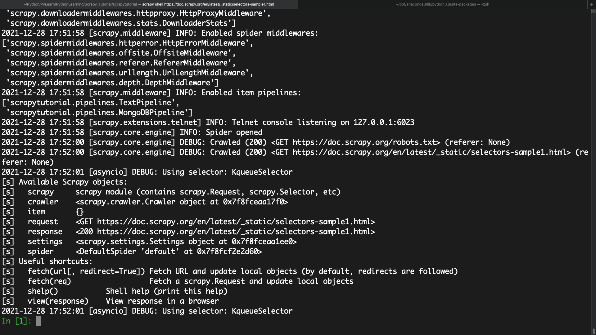

# 3.1直接使用
Selector其实并不一定非要在Scrapy中使用，他也是一个可以独立使用的模块。我们可以直接利用Selector这个类来构建一个选择器对象，然后调用它的相关方法来提取数据。

例如，针对一段HTML代码，我们可以用如下的方式构建Selector对象来提取数据：
```python
from scrapy import Selector

body = '<html><head><title>Hello World</title></head></html>'
selector = Selector(text=body)
title = selector.xpath('//title/text()').extract_first()
print(title)
```
运行结果如下：
```shell
Hello World
```

这里没有在Scrapy框架中运行，而是把Scrapy中的Selector单独拿出来使用了，构建的时候传入text参数，就生成了一个Selector选择器对象，然后就可以像Scrapy中解析方式一样，调用xpath、css等方法来提取数据了


# 3.2Scrapy Shell
由于Selector主要是与Scrapy结合使用，如Scrapy的回调函数中的参数response直接调用xpath或者css方法来提取数据，所以在这里我们借助Scrapy Shell来模拟Scrapy请求的过程。  
我们用官方文档中的一个样例页面来做演示：https://doc.scrapy.org/en/latest/_static/selector-sample1.html.  
`scrapy shell https://doc.scrapy.org/en/latest/_static/selectors-sample1.html`

进入Scrapy Shell模式，可以看到。


# 3.3XPath选择器
进入Scrapy Shell后，我们主要操作response.selector返回的内容就相当于用response的text构造了一个Selector对象。通过这个Selector，我们可以调用xpath、css等解析方法。

下面是一个实例：
```python
In [1]: result = response.selector.xpath('//a')

In [3]: result
Out[3]: 
[<Selector xpath='//a' data='<a href="image1.html">Name: My image ...'>,
 <Selector xpath='//a' data='<a href="image2.html">Name: My image ...'>,
 <Selector xpath='//a' data='<a href="image3.html">Name: My image ...'>,
 <Selector xpath='//a' data='<a href="image4.html">Name: My image ...'>,
 <Selector xpath='//a' data='<a href="image5.html">Name: My image ...'>]
```

打印结果是一个Selector组成的列表，其实他是个SelectorList类型，SelectorList和Selector都可以继续调用xpath和css等方法。
```python
In [4]: result.xpath('./img')
Out[4]: 
[<Selector xpath='./img' data=''>,
 <Selector xpath='./img' data=''>,
 <Selector xpath='./img' data=''>,
 <Selector xpath='./img' data=''>,
 <Selector xpath='./img' data=''>]
```

我们获得了a节点里面所有的img节点。值得注意的是，选择器最前方加`.`代表提取元素内部的数据，如果没有点，则代表从根节点开始提取。此处我们用了`./img`的提取方式，代表从a节点里提取。如果此处我们用`//img`，则还是从html节点里进行提取。

现在我们得到的是SelectorList类型的变量，该变量是由Selector对象组成的列表。可以用索引单独取出其中某个Selector元素，代码如下：
```python
In [5]: result[0]
Out[5]: <Selector xpath='//a' data='<a href="image1.html">Name: My image ...'>
```

我们可以使用`extract方法`获取a节点元素
```python
In [6]: result.extract()
Out[6]: 
['<a href="image1.html">Name: My image 1 <br></a>',
 '<a href="image2.html">Name: My image 2 <br></a>',
 '<a href="image3.html">Name: My image 3 <br></a>',
 '<a href="image4.html">Name: My image 4 <br></a>',
 '<a href="image5.html">Name: My image 5 <br></a>']
 ```

还可以使用XPath表达式，来选取节点的内部文本和属性
```python
In [7]: response.xpath('//a/text()').extract()
Out[7]: 
['Name: My image 1 ',
 'Name: My image 2 ',
 'Name: My image 3 ',
 'Name: My image 4 ',
 'Name: My image 5 ']

In [8]: response.xpath('//a/@href').extract()
Out[8]: ['image1.html', 'image2.html', 'image3.html', 'image4.html', 'image5.html']
```

现在，我们可以用一个规则获取所有符合要求的节点，返回的类型是列表类型。

# 3.4CSS选择器
Scrapy的选择器同时还对接了CSS选择器，使用response.css方法就可以使用CSS选择器来选择对应的元素了。

例如在之前我们选取了所有的a节点，使用`response.css`也可以做到
```python
In [9]: response.css('a')
Out[9]: 
[<Selector xpath='descendant-or-self::a' data='<a href="image1.html">Name: My image ...'>,
 <Selector xpath='descendant-or-self::a' data='<a href="image2.html">Name: My image ...'>,
 <Selector xpath='descendant-or-self::a' data='<a href="image3.html">Name: My image ...'>,
 <Selector xpath='descendant-or-self::a' data='<a href="image4.html">Name: My image ...'>,
 <Selector xpath='descendant-or-self::a' data='<a href="image5.html">Name: My image ...'>]
```
同样使用`extrat`方法可以提取节点
```python
In [10]: response.css('a').extract()
Out[10]: 
['<a href="image1.html">Name: My image 1 <br></a>',
 '<a href="image2.html">Name: My image 2 <br></a>',
 '<a href="image3.html">Name: My image 3 <br></a>',
 '<a href="image4.html">Name: My image 4 <br></a>',
 '<a href="image5.html">Name: My image 5 <br></a>']
 ```

另外，我们也可以进行属性选择和嵌套选择
```python
In [11]: response.css('a[href="image1.html"]').extract()
Out[11]: ['<a href="image1.html">Name: My image 1 <br></a>']

In [12]: response.css('a[href="image1.html"] img').extract()
Out[12]: ['']
```

节点的内部文本和属性的获取是略有区别的
```python
In [13]: response.css('a[href="image1.html"]::text').extract_first()
Out[13]: 'Name: My image 1 '

In [15]: response.css('a[href="image1.html"] img::attr(src)').extract_first()
Out[15]: 'image1_thumb.jpg'
```
获取文本和属性需要用`::text`和`::attr`的写法，而其他库如Beautiful Soup或pyquery都有单独的方法。

另外，CSS选择器和XPath选择器一样，能够嵌套选择。我们可以先用XPath选中所有a节点，再用CSS选择器选中img节点，然后再用XPath获取属性。
```python
In [16]: response.xpath('//a').css('img').xpath('@src').extract()
Out[16]: 
['image1_thumb.jpg',
 'image2_thumb.jpg',
 'image3_thumb.jpg',
 'image4_thumb.jpg',
 'image5_thumb.jpg']
```
如此一来，我们成功获取了所有的img节点的src属性。

# 3.5正则匹配
Scrapy的选择器还支持正则匹配。比如在示例的a节点中，文本类似于`Name: My image 1`,现在我们只想把后面的内容提取出来，就可以使用re方法
```python
In [17]: response.xpath('//a/text()').re('Name:\s(.*)')
Out[17]: ['My image 1 ', 'My image 2 ', 'My image 3 ', 'My image 4 ', 'My image 5 ']
```

我们给re方法传了一个正则表达式，其中`(.*)`就是要匹配的内容，输出结果就是正则表达式匹配的分组，结果会依次输出。

如果同时存在两个分组，那么结果也会按顺序输出
```python
In [18]: response.xpath('//a/text()').re('(.*?):\s(.*)')
Out[18]: 
['Name',
 'My image 1 ',
 'Name',
 'My image 2 ',
 'Name',
 'My image 3 ',
 'Name',
 'My image 4 ',
 'Name',
 'My image 5 ']
```

类似`extract_first`方法，`re_first`方法可以选取列表第一个元素
```python
In [19]: response.xpath('//a/text()').re_first('(.*?):\s(.*)')
Out[19]: 'Name'

In [20]: response.xpath('//a/text()').re_first('Name:\s(.*)')
Out[20]: 'My image 1 '
```
不论正则匹配了几个分组，结果都会等于列表第一个元素。  
值得注意的是，response对象不能直接调用`re`和`re_first`方法。如果想要对全文进行正则匹配，可以先调用xpath方法再正则匹配
```python
In [21]: response.re('Name:\s(.*)')
---------------------------------------------------------------------------
AttributeError                            Traceback (most recent call last)
<ipython-input-21-3635822752bd> in <module>
----> 1 response.re('Name:\s(.*)')

AttributeError: 'HtmlResponse' object has no attribute 're'

In [22]: response.xpath('.').re('Name:\s(.*)')
Out[22]: 
['My image 1 <br></a>',
 'My image 2 <br></a>',
 'My image 3 <br></a>',
 'My image 4 <br></a>',
 'My image 5 <br></a>']

In [23]: response.xpath('.').re_first('Name:\s(.*)')
Out[23]: 'My image 1 <br></a>'
```