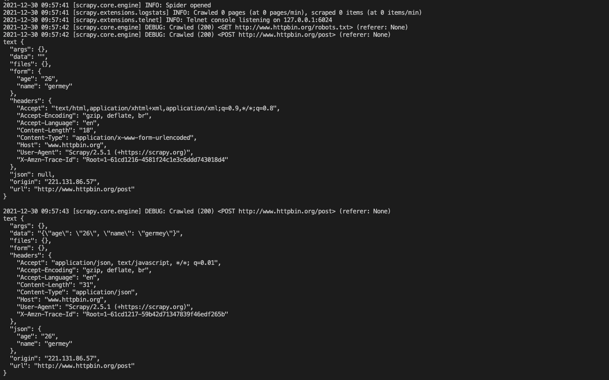

# 4.1Spider运行流程
在实现Scrapy爬虫项目时，最核心的类便是Spider类了。他定义了如何爬取某个网站的流程和解析方式。简单来说，Spider就是要做如下两件事：
- 定义爬取网站的动作
- 分析爬取下来的网页 

对于Spider类来说，整个爬取循环如下所述。  
(1)以初始的URL初始化Request并设置回调方法。当该Request成功请求并返回时，将生成的Response并将其作为参数传给该回调方法  
(2)在回调方法内分析返回的网页内容。返回结果可以是有两种形式，一种是将解析到的有效结果返回字典或Item对象，下一步可直接保存或经过处理后保存；另一种是解析的下一个（如下一页）链接，可以利用此链接构造Request并设置新的回调放啊，返回Request  
(3)如果返回的是字典或Item对象，可通过Feed Exports等形式存入文件，如果设置了Pipeline，可以经由Pipeline处理（如过滤、修正等）并保存  
(4)如果返回的是Request，那么Request执行成功得到的Response之后会再次传递给Request中定义的回调方法，可以再次使用选择器来分析新得到的网页内容，并根据分析的数据生成Item  


# 4.2Spider类分析
我们定义的Spider继承自`scrapy.spiders.Spider`，即`scrapy.Spider`类，二者指代的是同一个类，这个类是最简单最基本的Spider类，其他的Spider必须继承这个类。  
这个类提供了`start_requests`方法的默认实现，读取并请求`start_urls`属性，然后根据返回的结果调用parse方法解析结果。另外它还有一些基础属性

- name：爬虫名称，是定义的Spider名字的字符串。Spider的名字定义了Scrapyard如何定位并初始化Spider，所以它必须是唯一的。不过我们可以生成多个相同的Spider实例，这个没有任何限制。name是Spider最重要的属性，而且是必须的。如果该Spider爬取单个网站，一个常见的做法是以该网站的域名名称来命名spider。例如Spider爬取mywebsite.com，该Spider就叫mywebsite。
- allowed_domain：允许爬取的域名，是一个可选的配置，不在此范围的链接不会被跟进爬取。
- start_urls：起始URL列表，当我们没有实现`start_requests`方法时，默认会从这个列表开始抓取
- custom_settings：一个字典，是专属于本Spider的配置，此设置会覆盖项目全局的设置，而且此设置必须在初始化前被更新，所以它必须定义成类变量。
- crawler：此属性是由`from_crawler`方法设置的，代表的是本Spider类对应的Crawler对象，Crawler对象中包含了很多项目组件，利用它我们可以获取项目的一些配置信息，常见的就是获取项目的设置信息，即Settings。
- settings：一个Settings对象，利用它我们可以直接获取项目的全局设置变量

除了一些基础属性，Spider还有一些常用的方法
- start_requests：此方法用于生成初始请求，它必须返回一个可迭代对象，此方法会默认使用start_urls里面的URL构造Request，而且Request是GET请求方式。
- parse：当Response没有指定回调方法时，该方法会被默认调用，他负责处理Response，并从中提取想要的数据和下一步的请求，然后返回。该方法需要返回一个包含Request或Item的可迭代对象
- closed：当Spider关闭时，该方法会被调用，这里一般会定义释放资源的一些操作或其他收尾操作

# 4.3实例演示
首先我们创建一个Scrapy项目  
`scrapy startproject scrapyspiderdemo`  
运行完毕之后，当前运行目录便出现了一个scrapyspiderdemo文件夹，即对应的Scrapy项目就创建成功了。  
接着我们进入demo文件夹，来针对www.httpbin.org这个网站创建一个Spider  
`scrapy genspider httpbin www.httpbin.org`  
这时候我们可以看到项目目录下生成了一个HttpbinSpider，内容如下
```python
import scrapy

class HttpbinSpider(scrapy.Spider):
    name = 'httpbin'
    allowed_domains = ['www.httpbin.org']
    start_urls = ['http://www.httpbin.org/']

    def parse(self, response):
        pass
```
这时候我们可以在parse方法中打印输出一些response对象的基础信息，同时修改`start_urls`为http://www.httpbin.org/，这个链接可以返回GET请求的一些详情信息，最终我们可以将Spider修改。
```python
import scrapy

class HttpbinSpider(scrapy.Spider):
    name = 'httpbin'
    allowed_domains = ['www.httpbin.org']
    start_urls = ['http://www.httpbin.org/get']

    def parse(self, response):
        print('url', response.url)
        print('request', response.request)
        print('status', response.status)
        print('headers', response.headers)
        print('text', response.text)
        print('meta', response.meta)
```
这里我们打印了response的多个属性。
- url：请求的页面URL，即Request URL
- request：response对应的request对象
- status：状态码，即Response Status Code
- text：响应体，即Response Body
- meta：一些附加信息，这些参数往往会附在meta属性里

运行结果如下


可以看到，这里分别打印出了`url、request、status、headers、text、meta`信息。
注意，这里没有显式地申明初始请求，是因为Spider默认为我们实现了一个`start_requests`方法  
```python
def start_requests(self):
    for url in self.start_urls:
        yield Request(url, dont_filter=True)
```
可以看到，逻辑就是读取`start_urls`然后生成Request，这里并没有为Request指定callback，默认就是parse方法。他是一个生成器，返回所有的Request加入调度队列。  
因此，如果我们想要自定义初始请求，就可以在Spider中重写`start_quests`方法，比如我们想自定义请求页面链接和回调方法，可以把`start_requests`方法修改为下面这样
```python
import scrapy
from scrapy.http.request import Request
 
class HttpbinSpider(scrapy.Spider):
    name = 'httpbin'
    allowed_domains = ['www.httpbin.org']
    start_urls = ['http://www.httpbin.org/get']
    headers = {
        'User-Agent': 'Mozilla/5.0 (Macintosh; Intel Mac OS X 10_15_7) AppleWebKit/537.36\
             (KHTML, like Gecko) Chrome/96.0.4664.110 Safari/537.36'
    }
    cookies = {'name': 'germey', 'age': '26'}

    def start_requests(self):
        for offset in range(5):
            url = self.start_urls + f'?offset={offset}'
            yield Request(url, headers=self.headers,
                cookies=self.cookies, callback=self.parse_response,
                meta={'offset': offset})

    def parse(self, response):
        print('url', response.url)
        print('request', response.request)
        print('status', response.status)
        print('headers', response.headers)
        print('text', response.text)
        print('meta', response.meta)
```
这里我们自定义了如下内容：
- url：我们不再依赖`start_urls`生成url，而是申明了一个`start_url`，然后利用循环给URL加上了Query参数，如offset=0，拼接到https://www.httpbin.org/get后面，这样请求的链接就变成了https://www.httpbin.org/get?offset=0
- headers：这里我们还声明了headers变量，为它添加了User-Agent属性并将其传递给Request的headers参数进行赋值
- cookies：另外我们还声明了Cookie，以一个字典的形式声明，然后传给Request的cookies参数
- callback：在HttpbinSpider中，我们声明了一个`parse_response`方法，同时我们也将Request的callback参数设置为`parse_response`，这样当该Request请求成功时会回调`parse_response`方法进行处理。
- meta：meta可以用来传递额外的参数，这里我们将offset值也赋给Request，通过response.meta就能获取这个内容了，这样就实现了Request到Response的额外信息传递


这时候我们看到相应的设置就成功了。  
- url：url上多了我们添加的Query参数
- text：结果的headers上可以看到Cookie和User-Agent，说明Request的Cookie和User-Agent都设置成功了
- meta：meta中看到了offset这个参数，说明通过meta可以成功传递额外的参数

除了发起GET请求，我们还可以发送POST请求。POST请求主要分为两种，一种是以Form Data的形式提交表单，一种是发送JSON数据，二者可以分别使用FormRequest和JsonRequest来实现。

```python
import scrapy
from scrapy.http import FormRequest, JsonRequest

class HttpbinSpider(scrapy.Spider):
    name = 'httpbin'
    allowed_domains = ['www.httpbin.org']
    start_url = 'http://www.httpbin.org/post'
    headers = {
        'User-Agent': 'Mozilla/5.0 (Macintosh; Intel Mac OS X 10_15_7) AppleWebKit/537.36\
             (KHTML, like Gecko) Chrome/96.0.4664.110 Safari/537.36'
    }
    data = {'name': 'germey', 'age': '26'}

    def start_requests(self):
        yield FormRequest(self.start_url, callback=self.parse_response,
                formdata=self.data)
        yield JsonRequest(self.start_url, callback=self.parse_response,
                data=self.data)

    def parse_response(self, response):
        print('text', response.text)
```
这里我们利用`start_requests`方法生成了一个FormRequest和JsonRequest，请求的页面链接修改为了http://www.httpbin.org/post，他可以把POST请求的详情返回，另外data保持不变



这里我们可以看到两种请求的效果  
第一个FormRequest，我们可以观察到页面返回结果的form字段就是我们请求时添加的data内容，这说明实际上是发送了Content-Type为application/x-www-form-urlencoded的POST请求，这种对应的就是表单提交

第二个JsonRequest，我们可以观察到页面返回结果的json字段就是我们所请求时添加的data内容，这说明实际上是发送了Content-Type为application/json的POST请求，这种对应的就是发送JSON数据

# 4.4Request和Response

- Request  
在Scrapy中，Request对象实际上指的是`scrapy.http.Request`的一个实例，他包含了HTTP请求的基本信息，用这个Request类我们可以构造Request对象发送HTTP请求，他会包含Engine交给Downloader进行处理执行，返回一个Response对象  
Request类的构造参数：
    - url：Request的页面链接，即Request URL
    - callback：Request的回调方法，通常这个方法需要定义在Spider类里面，并且Xu要对应一个response参数，代表Request执行请求后得到的Response对象。如果这个callback参数不指定，默认会使用Spider类里面的parse方法
    - method：Request方法，默认是GET，还可以设置为POST、PUT、DELETE等。
    - meta：Request请求携带的额外参数，利用meta，我们可以指定任意处理参数，特定的参数经由Scrapy各个组件的处理，可以得到不同的效果。另外，meta还可以用来向回调方法传递信息。
    - body：Request的内容，即Request Body，往往Request Body对应的是POST请求，我们可以使用FormRequest或JsonRequest更方便地实现POST请求
    - headers：Request Headers，是字典形式
    - cookies：Request携带的Cookie，可以是字典或列表形式
    - encoding：Request的编码，默认是utf-8
    - priority：Request优先级，默认是0，这个优先级是给Scheduler做Request调度使用的，数值越大，就越被优先调度并执行
    - dont_filter：Request不去重，Scrapy默认会根据Request的信息进行去重，使得在爬取过程中不会出现重复请求，设置为True代表这个Request会被忽略去重操作，默认是为False
    - errback：错误处理方法，如果在请求处理过程中出现了错误，这个方法会被调用
    - flags：请求的标志，可以用于记录类似的处理
    - cb_kwargs：回调方法的额外参数，可以作为字典传递

以上便是Request的构造参数，利用这些参数，就可以灵活地实现Request的构造。  
值得注意的是，meta参数是一个十分有用且易扩展的参数，它可以以字典的形式传递，包含的信息不受限，所以很多Scrapy的插件会基于meta参数做一些特殊处理。在默认情况下，Scrapy就预留了一些特殊的key作为特殊处理。  
更多内容参见；https://docs.scrapy.org/en/latest/topics/request-response.html#request-meta-special-keys

- Response  
Request由Downloader执行之后，得到的就是Response结果了，它代表的是HTTP请求得到的响应结果
 
 - url：Request URL
 - status：Response状态码，如果请求成功就是200
 - headers：Response Headers是一个字典，字段是一一对应的
 - body：Response Body，这个通常是访问页面之后得到的源代码结果了，比如里面包含的是HTML或者JSON字符串，但其结果是bytes类型
 - request：Response对应的Request对象
 - certificate：是`twisted.internet.ssl.Certificate`类型的对象，通常代表一个SSL证书对象
 - ip_address：是一个`ipaddress.IPv4Address`或`ipaddress.IPv6Adderss`类型的对象，代表服务器的IP地址
 - urljoin：是对URL的一个处理方法，可以传入当前页面的相对URL，该方法处理后返回的就是绝对URL。
 - follow/follow_all：是一个根据URL来生成后续Request的方法，和直接构造Request不同的是，该方法接收的url可以是相对URL，不必一定是绝对URL

 另外Response还有几个常用的子类，如TextResponse和HtmlResponse，HtmlResponse又是TextResponse的子类，实际上回调方法接收的response参数就是一个HtmlResponse对象，它还有几个常用的方法或属性

- text：同body属性，但结果是str类型
- encoding：Response的编码，默认是utf-8
- selector：根据Response的内容构造而成的Selector对象，利用它我们可以进一步调用xpath、css等方法进行结果的提取
- xpath：传入XPath进行内容提取，等同于调用selector的xpath方法
- css：传入CSS选择器进行内容提取，等同于调用selector的css方法
- json：是Scrapy2.2新增的方法，利用该方法可以直接将text属性转为JSON对象


