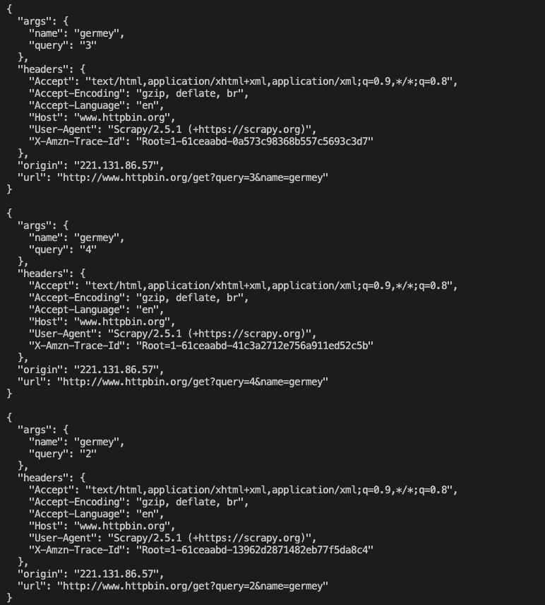

# 6.1使用说明
同样需要说明的是，Scrapy其实已经提供了许多Spider Middleware，与Downloader Middleware类似，它们被SPIDER_MIDDLEWARES_BASE变量所定义。

SPIDER_MIDDLEWARES_BASE变量的内容如下：
```python
{
    'scrapy.spidermiddlewares.httperror.HttpErrorMiddleware': 50,
    'scrapy.spidermiddlewares.offset.OffsetMiddleware': 500,
    'scrapy.spidermiddlewares.referer.RefererMiddleware': 700,
    'scrapy.spidermiddlewares.urllength.UrlLengthMiddleware': 800,
    'scrapy.spidermiddlewares.depth.DepthMiddleware': 900,
}
```
SPIDER_MIDDLEWARES_BASE里面定义的Spider Middleware是默认生效的，如果我们要自定义SPider Middleware，可以和Downloader Middleware一样，创建Spider Middleware并将其加入SPIDER_MIDDLEWARES。直接修改这个变量就可以添加自己定义的Spider Middleware。以及禁用SPIDER_MIDDLEWARES_BASE里面定义的Spider Middleware

# 6.2核心方法
Scrapy内置的Spider Middleware为Scrapy提供了基础的功能。如果我们想要扩展其功能，只需要实现几个方法。
每个Spider Middleware都定义了以下一个或多个方法的类，核心方法有如下4个。
- process_spider_input(response, spider)
- process_spider_output(response, result, spider)
- process_spider_exception(response, exception, spider)
- process_start_request(start_requests, spider)

只需要实现其中一个方法就可以定义一个Spider Middleware。下面我们看看这4个方法的详细用法。

- process_spider_input(response, spider)  
当Response通过Spider Middleware时，process_spider_input方法被调用，处理该Response。他有两个参数
    - response：Response对象，即被处理的Response
    - spider：Spider对象，即该Response对应的Spider对象

process_spider_input应该返回None或者抛出异常。
    - 如果它返回None，Scrapy会继续处理该Response，调用所有其他的Spider Middleware直到Spider处理该Response  
    - 如果它抛出一个异常，Scrapy不会调用任何其他Spider Middleware的process_spider_input方法，并调用Request的errback方法。errback的输出将会以另一个方向重新输入中间件，使用process_spider_output方法来处理，当其抛出异常时则调用process_spider_exception来处理


- process_spider_output(response, result, spider)  
当Spider处理Response返回结果时，process_spider_output方法被调用。他有3个参数
    - response：Response对象，即生成该输出的Response
    - result：包含Request或Item对象的可迭代对象，即Spider返回的结果
    - spider：Spider对象，即结果对应的Spider对象

process_spider_output必须返回包含Request或Item对象的可迭代对象

- process_spider_exception(response, exception, spider)  
当Spider或Spider Middleware的process_spider_input方法抛出异常时，process_spider_exception方法被调用。它有3个参数。
    - response：Response对象，被抛出的异常
    - exception：Exception对象，被抛出的异常
    - spider：Spider对象，即抛出该异常的Spider对象

process_spider_exception必须返回None或者一个（包含Response或Item对象的）可迭代对象。
    - 如果它返回None，那么Scrapy将继续处理该异常，调用其他Spider Middleware中的process_spider_exception方法，直到所有Spider Middleware都被调用。
    - 如果它返回一个可迭代对象，则其他Spider Middleware的process_spider_output方法被调用，其他的process_spider_exception不会被调用

- process_start_request(start_requests, spider)  
process_start_requests方法以Spider启动的Request为参数被调用，执行的过程类似于process_spider_output，只不过它没有相关联的Response并且必须返回Request。
    - start_requests：包含Request的可迭代对象，即StartRequests。
    - spider：Spider对象，即Start Requests所属的Spider

process_start_requests方法必须返回另一个包含Request对象的可迭代对象

# 6.3实战
首先我们新建一个Scrapy项目叫做scrapyspidermiddlewaredemo  
`scrapy startproject scrapyspidermiddlewaredemo`
然后新建一个Spider  
`scrapy genspider httpbin www.httpbin.org`

进入httpbin.py修改Spider
```python
from scrapy import Request, Spider

class HttpbinSpider(scrapy.Spider):
    name = 'httpbin'
    allowed_domains = ['www.httpbin.org']
    start_url = 'http://www.httpbin.org/get'

    def start_requests(self, response):
        for i in range(5):
            url = f'{self.start_url}?query={i}'
            yield Request(url, callback=self.parse)

    def parse(self, response):
        print(response.text)
```
运行代码`scrapy crawl httpbin`


这里我们可以看到几个Request对应的Response的内容被输出了，每个返回结果带有args参数，query为0-4 
另外我们可以定义一个Item，4个字段就是目标站点返回的字段，相关代码:
```python
import scrapy

class DemoItem(scrapy.Item):
    origin = scrapy.Field()
    headers = scrapy.Field()
    args = scrapy.Field()
    url = scrapy.Field()
```
可以在parse方法中将返回的Response的内容转化为DemoItem，将parse方法做如下修改：
```python
def parse(self, response):
        item = DemoItem(**response.json())
        yield item
```

重新运行，最终Spider就会产生对应的DemoItem了，运行效果如下：


可以看到原本Response的JSON数据就被转化为了DemoItem并返回。  
接下来在middlewares.py中重新声明一个CustomizeMiddleware类，内容如下：
```python
class CustomizeMiddleware(object):
    def process_start_requests(self, start_requests, spider):
        for request in start_requests:
            url = request.url
            url += '&name=germey'
            request = request.replace(url=url)
            yield request
```

这里实现了`process_start_requests`方法，它可以对start_requests表示的每个Request进行处理，我们首先获取了每个Request的URL，然后在URL的后面又拼接上了另一个Query参数，name等于germey，然后我们利用request的replace方法将url属性替换，这样就成功为Request赋值了新的URL。

接着我们需要将此CustomizeMiddleware开启，在settings.py中进行如下的定义：
```
SPIDER_MIDDLEWARES = {
    'scrapyspidermiddlewaredemo.middlewares.CustomizeMiddleware' : 543,
}
```
这样我们就开启了CustomizeMiddleware这Spider Middleware。  
重新运行Spider，这时候我们可以看到输出结果就变成了下面这样


可以观察到url属性成功添加了`name=germey`的内容，这说明我们利用Spider Middleware成功改写Request。  
除了改写start_requests，我们还可以对Response和Item进行改写，比如对Response进行改写，我们可以尝试更改其状态码，在CustomizeMiddleware里面增加如下定义：
```python
def process_spider_input(self, response, spider):
        response.status = 201
    
    def process_spider_output(self, response, result, spider):
        for i in result:
            if isinstance(i, DemoItem):
                i['origin'] = None
                yield i
```

这里定义了process_spider_input和process_spider_output方法，分别来处理Spider的输入和输出。对于process_spider_input方法来说，输入自然就是Response对象，所以第一个参数就是response，我们在这里直接修改了状态码。对于process_spider_output方法来说，输出就是Response或Item了，但是这里二者是混合在一起的，作为result参数传递过来。result是一个可迭代对象，我们遍历了result，然后判断了每个元素的类型，在这里使用isinstance方法进行判定：如果i是DemoItem类型，就把它的origin属性设置为空。当然这里还可以针对Request类型做类似的处理。

另外在parse方法里添加Response的状态码的输出结果
```python
print('Status:', response.status)
```

