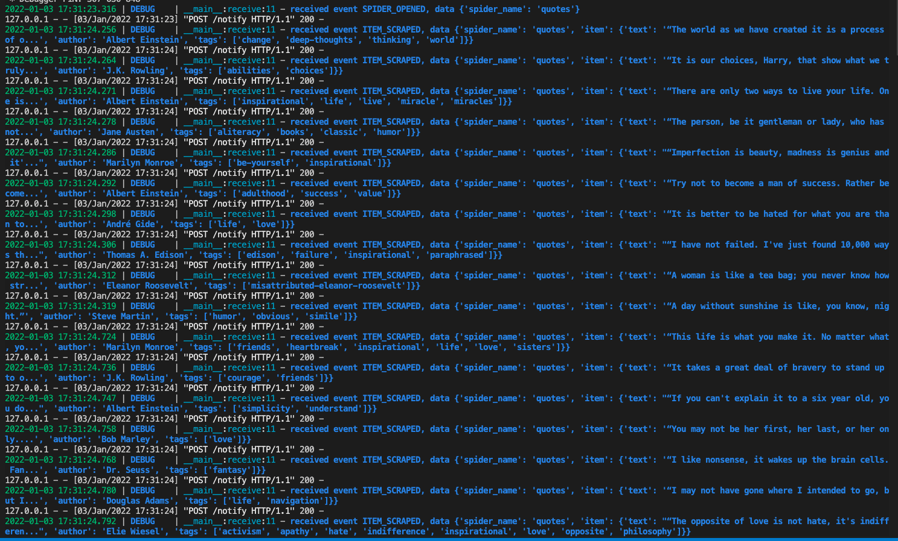

# 8.1Extension介绍
Scrapy提供了一些Extension机制，可以让我们添加和扩展一些自定义的功能。利用Extension我们可以注册一些Extension，如LogStats这个Extension用于记录一些基本的爬取信息，比如爬取的页面数量、提取的Item数量等，CoreStats这个Extension用于统计爬取过程中的核心统计信息，如开始爬取时间、爬取结束时间等。  
和Downloader Middleware、Spider Middleware以及Item Pipeline一样，Extension也是通过settings.py中的配置来控制是否被启用的，是通过`EXTENSION`这个配置项来实现的，例如：
```python
EXTENSION = {
    'scrapy.extensions.corestats.CoreStats': 500,
    'scrapy.extensions.telent.TelnetConsole': 501,
}
```
通过如上配置我们就开启了`CoreStats`和`TelnetConsole`这两个`Extension`.
另外我们也可以实现自定义的`Extension`，实现过程很简单，主要分为两步：
- 实现一个Python类，然后实现对应的处理方法，如实现一个`spider_opened`方法用于处理Spider开始爬取时执行的操作，可以接收一个spider参数并对其进行操作。
- 定义`from_crawler`类方法，其第一个参数是cls类对象，第二个参数是crawler。利用crawler的`singnals`对象将Scrapy的各个信号和已经定义的处理方法关联起来

# 8.2准备工作
我们将利用Extension实现爬取事件的消息通知。在爬取开始时、爬取到数据时、爬取结束时通知指定的服务器，将这些事件和对应的数据通过HTTP请求发送给服务器。

我们需要用到Flask来搭建一个简易的测试服务器，也需要利用requests来实现HTTP请求的发送，因此需要安装好Flask、requests和loguru这3个库，使用pip安装即可：  
`pip install flask requests loguru`

# 8.3实战
为了方便验证，这里可以用Flask定义一个轻量级服务器，用于接收POST请求并输出接收到的事件和数据，server.py的代码如下：
```python
from flask import Flask, request, jsonify
from loguru import logger

app = Flask(__name__)

@app.route('/notify', methods=['POST'])
def receive():
    post_data = request.get_json()
    event = post_data.get('event')
    data = post_data.get('data')
    logger.debug(f'received event {event}, data {data}')
    return jsonify(status='success')

if __name__ == "__main__":
    app.run(debug=True, host='0.0.0.0', port=5000)
```

然后运行它:  
`python server.py`

这样Flask服务器就在本地5000端口运行起来了。  
接下来我们基于前面`scrapytutorial`的代码,在scrapytutorial文件下新建一个extensions.py文件，先实现几个对应的事件处理方法：
```python
import requests

NOTIFICATION_URL = 'http://localhost:5000/notify'

class NotificaionExtension(object):
    def spider_opened(self, spider):
        requests.post(NOTIFICATION_URL, json={
            'event': 'SPIDER_OPENED',
            'data': {'spider_name': spider.name}
        })

    def spider_closed(self, spider):
        requests.post(NOTIFICATION_URL, json={
            'event': 'SPIDER_OPENED',
            'data': {'spider_name': spider.name}
        })

    def item_scraped(self, item, spider):
        requests.post(NOTIFICATION_URL, json={
            'event': 'ITEM_SCRAPED',
            'data': {'spider_name': spider.name, 'item': dict(item)}
        })
```
这里我们定义了一个NotificationExtension类，然后实现了3个方法，spider_opened、spider_closed和item_scraped，分别对应爬取开始、爬取结束和爬取到Item的处理。接着调用了requests向刚才我们搭建的HTTP服务器发送了对应的事件，其中包含两个字段：一个是event，代表事件的名称；另一个是data，代表一些附加数据，如Spider的名称、Item的具体内容等。

但仅仅这么定义还不够，现在启用这个Extension并没有任何效果，我们还需要将这些方法对应的Scrapy信号关联起来，再在NotificationExtension类中添加如下类方法：
```python
@classmethod
    def from_crawler(cls, crawler):
        ext = cls()
        crawler.signals.connect(ext.spider_opened, signal=signals.spider_opened)
        crawler.signals.connect(ext.spider_closed, signal=signals.spider_closed)
        crawler.signals.connect(ext.item_scraped, signal=signals.item_scraped)
        return ext
```
这里我们用到了Scrapy中的signals对象，所以还需要额外导入`from scrapy import signals`

其中，`from_crawler`是一个类对象，第一个参数就是cls类对象，第二个参数crawler代表了Scrapy运行过程中全局的Crawler对象

Crawler对象里有一个字对象叫做signals，通过调用signals对象的connect方法，我们可以将Scrapy运行过程中的某个信号和我们自定义的处理方法关联起来。这样在某个事件发生的时候，被关联的处理方法就会被调用。比如，这里connect方法第一个参数我们传入了`ext.spider_opened`这个对象，而ext是由cls类对象初始化的，所以ext.spider_opened就代表我们在`NotificaionExtension`类中定义的`spider_opened`方法。connect方法的第二个参数我们传入了`signals.spider_opened`这个对象，这就指定了`spider_opened`方法可以被`spider_opened`信号触发。这在Spider开始运行的时候，会产生`signals.spider_opened`信号，NotificationExtension类定义的spider_opened方法就会被调用了。

完成如上定义后，我们还需要开启这个Extension，在settins.py中添加如下内容即可：
```python
EXTENSIONS = {
   'scrapytutorial.extensions.NotificationExtension': 100,
}
```
接下来，运行quotes：  
`scrapy crawl quotes`

在Flask服务器的控制端看到如下的输出结果就是验证成功了。



我么通过一个自定义的Extension，成功实现了Scrapy爬取过程中和远程服务器的通信，远程服务器接收到这些事件之后就可以对事件和数据做进一步处理